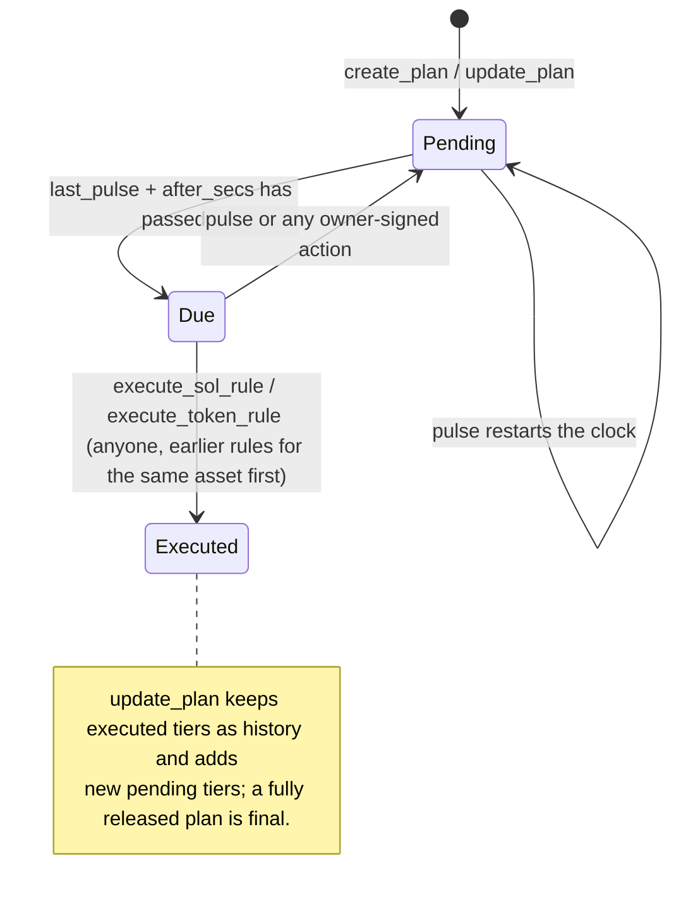

# Deadman

**The self-custody safety net for Seeker.**

Deadman is an Android app for the Solana Seeker plus an Anchor program. You put SOL and USDC in on-chain vaults (one per plan), and each vault covers three threats:

| Threat       | What happens                                                                                                                                                                                                                                                                                                                   |
| ------------ | ------------------------------------------------------------------------------------------------------------------------------------------------------------------------------------------------------------------------------------------------------------------------------------------------------------------------------ |
| **Silence**  | If you stop checking in, your **release plan** runs: up to 8 ordered rules, each paying a beneficiary a fixed amount or a percentage of one asset after a set period of silence. Payouts can go to a plain Solana wallet or privately.                                                                                         |
| **Coercion** | A duress PIN looks like a normal unlock and opens a decoy wallet: plausible plans and balances, and actions that seem to succeed but send nothing. Behind the scenes it signs `lockdown` on the real vaults with the device guard key, with no wallet prompt. Withdrawals and plan changes stay frozen until the lock expires. |
| **Loss**     | A lost or stolen phone holds only the guard key, which cannot move funds. You rotate it from your restored wallet. A guardian can freeze the vault while the phone is missing.                                                                                                                                                 |

You check in with a **Pulse**: one biometric touch, about 3 seconds, and no wallet prompt. It resets every pending rule. With **Family Circle**, your beneficiaries and guardian see your liveness ("checked in 2h ago") and the state of each tier that names them.

**Boney**, the mascot on the Pulse tab and the home-screen widget, keeps his status colour and can wear a skin (Crown, Cap or Glasses) while the wallet holds the matching Boney NFT (Token Metadata symbol `BONEY`, the skin's name in the NFT name, e.g. "Boney Crown"). Pick it in the "Meet Boney" sheet.

Next to these inheritance plans, a **vesting plan** releases SOL or USDC to up to 8 people in installments (monthly by default), with an optional cliff, whether you check in or not ([Vesting](#vesting)).

Deadman is free to use and has no subscription. It charges **2%** only when a rule or vesting schedule actually releases funds, or **1.5%** when the payout is in **$SKR**, and 10% of every SKR fee is burned. Withdrawing, closing a plan and revoking vesting are always free ([Pricing](#pricing)). Network fees are paid in SOL, or, if you opt in, in USDC through a Kora paymaster, so a wallet with no SOL can use every feature ([Network fees in USDC](#network-fees-in-usdc)).

> **Status: unaudited hackathon build.** The program runs on devnet. The private rails (Cloak, Zcash) and Earn call mainnet-only services and work only in a mainnet build. Do not put real funds in it.

For a plain-language walkthrough, see [docs/HOW_IT_WORKS.md](docs/HOW_IT_WORKS.md).

## Why it is different

Dead-man switches and inheritance vaults are a crowded idea on Solana. Colosseum's project archive lists 15+ near-identical projects, and none of them won an award ([evidence](docs/JUDGING.md#prior-art-colosseum-copilot)). The closest one, [SolGuard](https://colosseum.com/projects/explore/solguard-5), already has heartbeat inheritance, a duress key and defend-only guardians. Its interface is a web app.

Deadman's bet is execution on the phone, plus a release plan richer than "split it N ways at death":

- **Guard key.** Each install generates a hot key in secure storage behind biometrics. On-chain, this key may only `pulse` and `lockdown`; it can never withdraw. Check-ins and the duress path therefore need no Seed Vault prompt, and a stolen guard key cannot take funds.
- **Duress shows a decoy and locks the real vault.** The duress PIN opens a fake wallet (plausible plans, balances and check-in history; every action looks like it worked but nothing is built, signed or sent; no recovery phrase, receiving profiles or real addresses). Funds are never sent to a "safe wallet" that the attacker could demand next: the real vaults are frozen for `lock_secs`, and an early unlock needs the owner and the guardian to sign together.
- **Vesting next to inheritance.** The same vault, keys and lockdown also run installment vesting schedules (payroll, allowances, a gift over time), revocable or irrevocable.
- **Tiered release, not a single trigger.** "After 10 days, 1 SOL to my partner; after 30 days, everything else to my brother." Tiers fire one by one, and one Pulse stops the rest. A long trip costs you the first tier at most, not the estate.
- **Private delivery.** A tier can pay out through Cloak (shielded pool on Solana) or as shielded ZEC, so a beneficiary's main wallet is not publicly tied to the estate on Solana. The limits of that privacy are spelled out [below](#private-rails).
- **A habit and a social loop.** The Pulse and Family Circle answer the question every proof-of-life app faces: "why open it when nothing is happening?"
- **Seeker-native.** The owner key stays in the Seed Vault and is reached through Mobile Wallet Adapter. Distribution is the Solana dApp Store.

## How it works

```mermaid
stateDiagram-v2
    [*] --> Armed: create_plan (owner, counts as first pulse)
    state Armed {
        [*] --> Unlocked
        Unlocked --> Locked: lockdown (owner, guard, or guardian outside cooldown)
        Locked --> Locked: lockdown again (extends)
        Locked --> Unlocked: lock expires, or unlock (owner + guardian)
    }
    note right of Armed
        pulse (owner or guard) and every owner-signed action
        reset last_pulse. A lockdown does not, and it does not
        block rule execution.
    end note
    Armed --> [*]: close_vault (owner, unlocked only; rent to rent_payer)
```



Each rule in the plan has its own lifecycle. "Due" is not stored; it is computed from `last_pulse`:



- **Release plan.** 1 to 8 rules, sorted by `after_secs`. Each rule has a `beneficiary`, a `rail` (Solana, Cloak or Zcash), `after_secs` of owner silence, an asset (`mint: None` for SOL, or any SPL mint; the app offers SOL, USDC, SKR, ORE, JitoSOL on mainnet, any pasted mint, and classic NFTs as a Fixed 1 tier) and an amount: `Fixed` (lamports or base units, capped at the balance) or `Percent` (bps of the asset's balance at execution time).
- **Firing.** A rule is due when `now > last_pulse + after_secs`. There is no separate check-in interval: each tier's `after_secs` (60 s to about 3 years, in ascending order) is the whole timer, and any check-in restarts every tier's clock. The app shows the time until the next release as the plan being alive. The editor offers **7 days**, **30 days** or **Custom** (any number of days, hours or minutes, 60 s minimum) as the check-in window.
- **Execution is permissionless.** Anyone can execute a due rule, usually the protocol keeper (`tool/keeper.dart`). Destinations are fixed on-chain, so the executor cannot redirect anything. Order is enforced per asset: a SOL rule never waits on a USDC rule, but two SOL rules execute in index order.
- **A Pulse resets, it does not refund.** A pulse restarts the clock for every pending rule. Rules already executed stay executed.
- **Fee.** On execution, `fee = gross × fee_bps / 10 000` goes to the treasury and the beneficiary receives the rest. The rate is per rail in `Config` (2% on both rails), except that a payout in the SKR mint (`config.skr_mint`) pays `fee_bps_skr` (1.5%) on any rail, and `skr_burn_bps` (10%) of that SKR fee is burned from the vault's token account instead of going to the treasury. Withdrawing, closing a plan and revoking vesting pay no fee. If a SOL payout to a brand-new account would leave it below rent exemption, the tier stays pending (`BeneficiaryCannotReceive`); once the plan's grace period has passed anyone may `skip_rule` it, so a tiny tier cannot block the ones after it, and its share stays reserved for its beneficiary.
- **Lockdown and inheritance.** A lockdown freezes withdrawals, plan changes and closing. It does not block pulses, guard rotation or rule execution.

### Instructions

| Instruction                                   | Signer(s)                                     | Effect                                                                                                                                                                                                                                             |
| --------------------------------------------- | --------------------------------------------- | -------------------------------------------------------------------------------------------------------------------------------------------------------------------------------------------------------------------------------------------------- |
| `init_config` | program upgrade authority | Creates the `Config` PDA with the treasury (passed as an account; must be a system-owned, non-executable wallet), the SKR mint and the default fees: `fee_bps_public` = `fee_bps_private` = 200 (2%), `fee_bps_skr` = 150 (1.5%), `skr_burn_bps` = 1000 (10% of the SKR fee burned). |
| `set_config` | `config.admin` | Updates the treasury, the three fee rates (each capped at 500 bps), the SKR mint and the burn share (at most 10 000). Reallocates a Config created by an older build (77 → 209 bytes). |
| `propose_admin` | `config.admin` | Proposes a new admin (`Pubkey::default()` cancels a pending proposal). Emits `AdminProposed`. |
| `accept_admin` | the proposed admin | Completes the two-step rotation. Emits `AdminChanged`. |
| `create_plan`                                 | owner (+ `payer`, the owner or a fee sponsor) | Creates inheritance `Vault` PDA `["vault", owner, plan_id]` with a label, the guard key, `lock_secs`, the skip grace and the rules. Stores `payer` as `rent_payer` and the rent it actually deposited as `rent_paid`. Every token mint in the rules is passed as a read-only remaining account and must be a classic SPL Token mint (`UnsupportedMint` otherwise). Counts as the first pulse.                                                     |
| `create_vesting`                              | owner (+ `payer`)                             | Creates a vesting `Vault` (same PDA) with `start_at`, `revocable`, `lock_secs` and 1 to 8 schedules (beneficiary, rail, asset, total, cliff, duration). Same mint rule as `create_plan`.                                                                                            |
| `update_plan`                                 | owner                                         | Replaces the lock length, skip grace, guardian and the pending tiers; paid or skipped tiers stay as history and keep their stipend bits. Same mint rule as `create_plan`. Blocked while locked and once the plan has fully released (`PlanCompleted`).                                                          |
| `set_guard`                                   | owner                                         | Rotates the guard key. **Allowed during lockdown.**                                                                                                                                                                                                |
| `pulse`                                       | owner or guard                                | Resets `last_pulse` and updates `streak`, `best_streak` and `total_pulses`. Inheritance plans only.                                                                                                                                                |
| `lockdown`                                    | owner, guard or guardian                      | `locked_until = max(locked_until, now + lock_secs)`. Does not reset the clock. A guardian must wait until `guardian_ready_at`, which is set to `locked_until + lock_secs`.                                                                         |
| `unlock`                                      | owner **and** guardian                        | Ends a lockdown early.                                                                                                                                                                                                                             |
| `withdraw_sol`                                | owner                                         | Withdraws lamports above rent. Blocked while locked. On a vesting plan, only what the schedules do not owe (`FundsCommitted`).                                                                                                                     |
| `withdraw_token`                              | owner                                         | Withdraws from the vault's ATA (SPL Token, or Token-2022 to recover stray tokens). Blocked while locked. Same vesting limit, and never a skipped tier's reserve.                                                                                                                                                |
| `close_vault`                                 | owner                                         | Closes the vault: the rent goes to `vault.rent_payer` (the owner, or Kora), everything above rent to the owner. Blocked while locked, on a vesting plan while anything is owed, and while a skipped tier still holds a reserve. Does not sweep token accounts.                                 |
| `execute_sol_rule` | anyone | Pays a due SOL rule to its beneficiary, minus the rail's fee to the treasury. |
| `execute_token_rule` | anyone (pays rent for the beneficiary's ATA) | Pays a due token rule, minus the fee to the treasury's ATA (the treasury account may be left out when the payout leaves the treasury nothing, e.g. a single NFT). A payout in the SKR mint pays 1.5% and burns 10% of that fee. On a private rail it also tops the claim key up with SOL (0.012 on Cloak, 0.003 on Zcash) if the claim key has less and the vault can spare it. |
| `skip_rule`                                   | anyone                                        | Lets later tiers run past a tier that still cannot pay after the plan's grace period. Its share stays reserved and claimable by its beneficiary.                                                                                                   |
| `release_vested_sol` / `release_vested_token` | anyone | Pays a vesting schedule what has vested and not yet been released (capped at the vault balance), minus the rail's fee (the SKR rate and burn for SKR schedules). |
| `revoke_vesting`                              | owner                                         | Stops future vesting on a revocable plan. Vested amounts stay claimable; the rest becomes withdrawable. Blocked while locked.                                                                                                                      |

There is no deposit instruction. To deposit SOL, send a plain system transfer to the vault PDA. To deposit tokens, transfer them into the vault PDA's associated token account.

### Pricing

| Line                            | Who pays           | Rate                                                                                                                                                                                                                                                                                                                                                                                                                                                                     |
| ------------------------------- | ------------------ | ------------------------------------------------------------------------------------------------------------------------------------------------------------------------------------------------------------------------------------------------------------------------------------------------------------------------------------------------------------------------------------------------------------------------------------------------------------------------ |
| Using the app                   | nobody             | Free. Creating plans, depositing, checking in and locking cost only network fees.                                                                                                                                                                                                                                                                                                                                                                                        |
| Release fee | the released funds | 2% on every rail (`fee_bps_public` = `fee_bps_private` = 200, admin-set with `tool/set_config.dart`), charged on-chain only when a rule executes or a vesting installment is released. The private-rail gas stipend comes from the vault, not from the fee. |
| Release fee in SKR | the released funds | A payout in SKR (`config.skr_mint`) pays 1.5% instead (`fee_bps_skr` = 150), on any rail, taken in SKR. 10% of that fee (`skr_burn_bps` = 1000) is burned in the same instruction, so the SKR supply drops; the other 90% goes to the treasury's SKR account. |
| Withdraw, close, revoke         | nobody             | Free. `withdraw_sol`, `withdraw_token`, `close_vault` and `revoke_vesting` move nothing to the treasury.                                                                                                                                                                                                                                                                                                                                                                 |
| Hard cap                        | -                  | 5% for each rate, enforced in the program (`MAX_FEE_BPS = 500`); the burn share is at most 100%                                                                                                                                                                                                                                                                                                                                                                                                               |
| Vesting release fee             | the released funds | Same as the payout fee of the schedule's rail and asset (1.5% with the burn for SKR)                                                                                                                                                                                                                                                                                                                                                                                                                            |
| Network fees in USDC (optional) | the owner          | Kora paymaster: 3.00 USDC (new plan, Kora pays the rent), 1.00 USDC (Kora opens token accounts), 0.02 USDC (anything else). In SOL, the normal Solana fee.                                                                                                                                                                                                                                                                                                               |
| Earn swap (optional)            | the owner          | Jupiter referral fee, at least 50 bps; Jupiter keeps 20% of it                                                                                                                                                                                                                                                                                                                                                                                                           |
| Zcash routing (optional)        | the beneficiary    | NEAR Intents `appFees`, split 50/50 with 1Click. Off by default until a treasury NEAR account is set.                                                                                                                                                                                                                                                                                                                                                                    |

NFT payouts pay no fee: the fee on an amount of 1 rounds down to 0. Supported NFTs are classic Metaplex NFTs (0 decimals, supply 1, Token Metadata); programmable, compressed, Metaplex Core and Token-2022 NFTs are not supported yet. Assets and NFT details: [docs/HOW_IT_WORKS.md §3.9](docs/HOW_IT_WORKS.md#39-assets-sol-usdc-skr-ore-other-tokens-and-nfts).

Duration bounds enforced on-chain: tier delay 60 s to about 3 years (ascending), lock 60 s to 30 days, vesting cliff ≤ duration ≤ 20 years with a start at most 366 days before or after creation. The 60-second minimums exist so the switch can be demoed live; with Demo timings on, the app offers 1, 2, 5 and 10-minute waits.

Full account, trust and threat models: [docs/ARCHITECTURE.md](docs/ARCHITECTURE.md).

## Vesting

A vesting plan (`PlanKind::Vesting`, `create_vesting`) holds up to 8 schedules. Each pays `total` of SOL or a token (USDC in the app) to one beneficiary from the plan's `start_at` over `duration_secs`, nothing before `cliff_secs`, in installments of the plan's `period_secs`: only whole periods since `start_at` count, so value unlocks once per period (the last installment lands exactly at `duration_secs`) and a claim between installments fails with `NothingToPay`. `period_secs` is 60 s up to the shortest duration, or 0 for continuous per-second vesting (also how plans created before installments read). See [How it works §3.4](docs/HOW_IT_WORKS.md).

- **Release:** anyone calls `release_vested_sol` / `release_vested_token`. The keeper releases an installment once the treasury's share of its fee covers the network fee, and continuous plans at most once per `--vest-interval` (and once fully vested); smaller releases are left for the owner (**Release**) or the beneficiary (**Claim vested** in Family Circle). Each release pays the release fee (2%, or 1.5% in SKR with 10% of it burned).
- **Revocable or irrevocable.** `revoke_vesting` stops future vesting; the installments unlocked by then stay claimable.
- **Committed funds:** the owner can always deposit, but withdraws only what the plan does not owe, and closes it only when nothing is owed.
- **Not part of check-ins:** `pulse` refuses vesting plans. **Lockdown covers them**: the duress PIN and Panic freeze withdraw, revoke and close; releases continue.
- App: `lib/ui/screens/vesting_editor.dart`, `VestingPlanCard` in `lib/ui/screens/pulse_tab.dart`, claims in `lib/ui/screens/circle_tab.dart`.

## Network fees in USDC

USDC is `AppConfig.usdcMint` (`lib/core/config.dart`): Circle's devnet USDC by default, overridable with `--dart-define=USDC_MINT=...`. Plans take USDC deposits and withdrawals, the rules editor writes USDC tiers, and vesting schedules can pay USDC, all in USDC units.

Owners can also pay network fees in USDC (Security → "Pay network fees with: SOL | USDC", `lib/state/fee_settings.dart`). A [Kora](https://github.com/solana-foundation/kora) paymaster behind a policy gateway (`tool/kora_gateway.dart`, :8081) pays the SOL fee, and rent where needed, and each transaction ends with a USDC payment. Three tiers, one Kora node each, chosen by what Kora funds:

| Tier    | Kora node | Price     | Kora funds                                                |
| ------- | --------- | --------- | --------------------------------------------------------- |
| plan    | :8091     | 3.00 USDC | a new vault's rent (returned to Kora on close) + ≤ 2 ATAs |
| account | :8092     | 1.00 USDC | ≤ 2 token accounts                                        |
| basic   | :8093     | 0.02 USDC | the network fee only                                      |

The client drops Kora-paid ATA creates for ATAs that already exist, so a transaction lands in the cheapest tier that fits. Guard-key check-ins stay free through the Kora sponsor (:8080). On 2026-10-04 an owner with 0 SOL created, released and closed a USDC vesting plan on devnet this way (`tool/e2e_usdc_vesting.dart`). Setup, policies and results: [docs/KORA.md](docs/KORA.md).

## Private rails

On-chain, every rail pays a Solana key. For Cloak and Zcash that key is a **claim key**: a fresh keypair the beneficiary's Deadman app generates (Security → Receive privately) and shares as a claim code such as `zcash:<address>`. The owner pastes the code into a tier. When the tier releases, the beneficiary's app routes the funds onward:

- **Zcash.** Through the NEAR Intents 1Click API to the beneficiary's unified `u1` address. The claim key deposits into a one-time 1Click deposit address; solvers deliver ZEC; refunds go back to the claim key. Details: [docs/research/zcash-near-intents.md](docs/research/zcash-near-intents.md).
- **Cloak.** Through the Cloak SDK bundled into a headless WebView, which builds a Groth16 proof on the device and deposits into Cloak's shielded pool. Details: [docs/research/cloak.md](docs/research/cloak.md).
- **Gas.** A private token payout also sends the claim key SOL (0.012 on Cloak, 0.003 on Zcash), so it can pay routing fees without being funded from a linkable wallet.
- **Mainnet only.** Cloak has no devnet deployment, and 1Click routes real assets. On devnet the program still pays claim keys, but routing is disabled.

What this privacy does **not** cover:

- The vault → claim key payout is public on Solana: amount, time and rail.
- **Zcash:** the NEAR Intents explorer publicly maps each 1Click deposit address to the recipient `u1` address and the amounts. Anyone can link vault → claim key → `u1`. What stays private is everything the beneficiary does with the ZEC afterwards, so they should use a fresh, shielded-only `u1` per payout.
- **Cloak:** the deposit amount into the pool is visible and linkable to the vault. A private send out of the pool is linked to the deposit only by amount and timing. Cloak's relay holds the claim identity's viewing key and can see the whole path.
- Operators (1Click, Cloak's relay, RPC providers) see IP addresses and keys.
- If the beneficiary releases a private tier from their own wallet, that wallet becomes the public executor. The keeper exists so they do not have to.

## Earn

Idle SOL in the vault earns nothing. Earn swaps SOL for JitoSOL through Jupiter Swap V2 (`/order`, then `/execute`), with an optional Jupiter referral fee to the treasury (minimum 50 bps; Jupiter keeps 20%). The app then deposits the JitoSOL into the vault as an ordinary token, so a rule can pay it out like any other SPL asset. The program has no CPI into Jupiter or the stake pool. Earn is mainnet-only. The user pays the swap fee, and beneficiaries of a JitoSOL rule receive JitoSOL with its depeg exposure. See [docs/research/earn-jupiter-jito.md](docs/research/earn-jupiter-jito.md).

## Keeper

`tool/keeper.dart` scans every vault and executes due rules with its own key. It executes at most one rule per vault per sweep, so a percentage rule always sees the balance that earlier rules left. On vesting plans it releases each schedule at most once per `--vest-interval` (default 86 400 s), and always once the schedule is fully vested. The keeper pays transaction fees and, for token rules, the rent for the beneficiary's and the treasury's token accounts, but only when the treasury's share of the fee (after the SKR burn) covers that cost; otherwise it leaves the payout for the beneficiary to claim. A payout that leaves the treasury nothing (a single NFT) needs no treasury token account. Anyone can run it, and beneficiaries can also release a due tier from the Family Circle tab.

```bash
dart run tool/keeper.dart --keypair <path> --rpc https://api.devnet.solana.com --every 30 [--vest-interval 86400]
```

## Repository layout

```
onchain/                   Anchor workspace
  programs/deadman/src/    program (lib.rs, state.rs, instructions/{config,vault,funds}.rs)
  programs/deadman/tests/  LiteSVM integration tests
  target/idl/deadman.json  IDL
lib/                       Flutter app
  core/config.dart         cluster, RPC, program id (override with --dart-define)
  solana/                  program client: codec, tx builders, guard-key and keeper actions, paymaster (USDC fee) flow
  kora/                    Kora JSON-RPC client (sponsor and paymaster)
  wallet/                  wallet contract: MWA platform-channel bridge (Android), Phantom/Solflare bridge (web)
  rails/                   Zcash (1Click), Cloak (SDK in a headless WebView), Earn (Jupiter)
  state/, ui/              Riverpod state and screens (rules_editor.dart is the release plan, vesting_editor.dart the vesting plan)
assets/cloak/              bundled Cloak SDK and its WebView host page
web/                       Flutter web host page and manifest
android/                   Android host app (app.deadman.seeker), Kotlin MWA bridge to Seed Vault Wallet
tool/keeper.dart           protocol keeper
tool/kora_gateway.dart     public gateway in front of the Kora sponsor and paymaster nodes
tool/e2e_usdc_vesting.dart devnet end-to-end check: USDC vesting with fees paid in USDC
tool/e2e_gasless_claims.dart devnet end-to-end check: a 0-SOL heir claims SOL (sponsor) and USDC (paymaster)
kora/                      Kora node configs (sponsor.toml, paymaster.toml, signers.toml)
scripts/kora_start.sh      start Redis, the Kora nodes and the gateway (kora_stop.sh stops them)
tool/init_config.dart      admin: initialize Config (treasury, SKR mint, default 2% / 2% / 1.5% SKR, 10% burn)
tool/set_config.dart       admin: change the treasury, fees, SKR mint and burn share (default 200 / 200 / 150 bps, 1000 bps burned); propose-admin / accept-admin
tool/cloak_bundle/         esbuild project that produces assets/cloak/cloak.js
scripts/devnet_setup.sh    one-time Config setup after deploy
test/                      Dart tests for the rails and the program client
docs/                      how it works, architecture, pitch outline, demo script, research, judging report
```

## Build and test

Toolchain: Rust 1.89.0 (pinned in `onchain/rust-toolchain.toml`), Anchor 1.1.2, Flutter with Dart SDK ^3.13.

```bash
# Program
cd onchain
anchor build                        # writes target/deploy/deadman.so
cargo fmt --all
cargo clippy -- -W clippy::all
cargo test                          # LiteSVM tests load target/deploy/deadman.so, so build first

# One-time Config after deploying (signs with the upgrade authority)
cd ..
KEYPAIR=<upgrade-authority.json> scripts/devnet_setup.sh   # 2% / 2% / 1.5% SKR, 10% burn; TREASURY defaults to the admin
dart run tool/set_config.dart --keypair <admin.json>         # change fees on an existing Config (also migrates an old 77-byte Config)
dart run tool/create_test_nft.dart --keypair <scratch key> --to <wallet>  # devnet demo NFT
dart run tool/e2e_skr_nft.dart --dry-run                 # SKR payout (1.5%, 10% burned) + NFT tier e2e (drop --dry-run once deployed)

# App
flutter pub get
flutter test
flutter build apk                   # devnet: Solana rail end to end
flutter build apk --dart-define=KORA_SPONSOR_URL=http://<LAN>:8080 \
  --dart-define=KORA_PAYMASTER_URL=http://<LAN>:8081 \
  --dart-define=USDC_MINT=<test mint>                   # devnet with free check-ins and USDC fees (docs/KORA.md)
flutter build apk --dart-define=CLUSTER=mainnet-beta --dart-define=RPC_URL=<rpc> \
  --dart-define=JUP_API_KEY=<key> --dart-define=JUP_REFERRAL_ACCOUNT=<account> \
  --dart-define=ONECLICK_JWT=<optional partner token>      # private rails and Earn
```

`flutter test` runs 1,033 tests and skips 16, the opt-in brand renders (`flutter test test/brand_review --dart-define=BRAND_RENDER=true` writes `build/brand_review_v2/*.png`). `cargo test` runs 124 LiteSVM tests. The 77 in `onchain/programs/deadman/tests/test_deadman.rs` cover: config gated to the upgrade authority with the default fees (2% / 2% / 1.5% SKR, 10% burned), the 5% cap and treasury validation, migrating a 77-byte Config, two-step admin rotation, guard pulses and day streaks, rule validation, tiered SOL rules paying in order with per-rail fees, per-asset ordering, a pulse resetting pending rules after a partial release, dust to a fresh account being skipped, token rules with fees and independent order, SKR payouts and vesting releases at 1.5% with 10% of the fee burned (supply drops by exactly the burned amount, the treasury gets 90%), a zero burn share, the treasury ATA being required or wrong, the private-rail gas stipend, duress lockdown freezing funds and policy, lockdown not stopping inheritance, the guard being unable to move funds, the guardian lockdown cooldown and removal, co-signed unlock, owner-only token withdrawal, `close_vault` blocked while locked, independent plans per owner, a sponsor paying vault rent and getting it back on close, skipping unpayable tiers and their reserves surviving withdrawals and blocking close, SPL-only plan mints, the guard-only check-in window, vesting (linear and installment release after the cliff, one payout per installment, committed funds, revocation, token releases with fees, validation, plan kinds not mixing), a classic NFT released whole as a Fixed 1 tier, withdraw, close and revoke staying free, and a compute-unit profile. The `review_*.rs` files hold the audit regression tests ([docs/security-audit-2026-10-08.md](docs/security-audit-2026-10-08.md#resolution-2026-10-08)), and `onchain/trident-tests` the Trident fuzz harness.

**Program ID:** `ACHVLMoLDM3YPpGbNST4cZW4Tf2jx6nzJGuusyLJHofL`. Check the devnet deployment with `solana program show ACHVLMoLDM3YPpGbNST4cZW4Tf2jx6nzJGuusyLJHofL --url devnet`.

## Web version

The same Flutter app also builds for the browser. It reuses the program client (`lib/solana`), state (`lib/state`) and screens (`lib/ui`). Only the wallet bridge and a few Android-only features are swapped out on web.

```bash
flutter run -d chrome                                   # dev server, devnet
flutter build web --release                             # static site in build/web
flutter build web --release --wasm                      # optional WebAssembly build
cd build/web && python3 -m http.server 8080             # serve locally on http://localhost:8080
```

Serve it over https, or on `localhost` while developing. On web, claim keys, the recovery phrase and the guard key are encrypted behind the PIN (PBKDF2, AES-GCM) and again with a non-extractable WebCrypto device key in IndexedDB (`lib/state/secure_store_web.dart`); the duress PIN unlocks only the guard key. WebCrypto needs a secure context. `web/index.html` sets a Content-Security-Policy that allows only https and wss endpoints, so a plain `http://` gateway or RPC is blocked on web.

**Dart defines.** Web builds take the same `--dart-define`s as the APK: `CLUSTER`, `RPC_URL`, `WS_URL`, `USDC_MINT`, `SKR_MINT`, `ORE_MINT`, `KORA_PAYMASTER_URL`, `KORA_PAYMASTER_SIGNER`, `KORA_SPONSOR_URL` and `KORA_API_KEY`. One is web-only: `ANDROID_APP_URL`, the link on the "Get the Android app" card. The RPC and any Kora endpoint must allow CORS from the site's origin. The public devnet RPC does. `tool/kora_gateway.dart` does not send CORS headers yet, so on web the network-fee choice (SOL or USDC) only works behind a proxy that adds them.

**Wallets.** Phantom and Solflare browser extensions. The app finds them through the Wallet Standard and signs raw transaction bytes with `solana:signTransaction` on the build's cluster. Before signing, it checks that the connected account is one of the transaction's signers. Wallets that only inject the old `window.phantom.solana` or `window.solflare` provider are still supported: the app then loads `@solana/web3.js` 1.98.4 from jsDelivr, pinned with an SRI hash, on first sign. The choice of wallet is remembered, and after a reload the app reconnects on the first signature. Switch the wallet to devnet before approving on a devnet build.

**What is Android-only.** Check-in reminders (Workmanager and notifications), one-tap check-ins with the guard key, the biometric lock, moving the guard key between devices, Cloak and Zcash private routing (Cloak runs in an Android WebView), the shielded inbox and the private rails check are Android-only. On web, "I'm alive" and panic lockdown are signed in the wallet, one approval for all plans. The duress PIN only locks plans guarded by this browser's key, and only while the page is open. Receiving profiles and their recovery phrase work on both.

## Mainnet

Not deployed yet. The program deploys to the same address on mainnet, and the private rails can only be tested there. [docs/MAINNET.md](docs/MAINNET.md) is the runbook: gate, preflight, verifiable build, deploy (about 7.6 SOL needed, 5.1 SOL stays locked as rent), Config, IDL, upgrade authority to Squads, Kora behind TLS, keeper service, mainnet APK flags, and the real-funds test.

```bash
RPC_URL=<mainnet rpc> scripts/mainnet_preflight.sh       # read-only checks and cost estimate
dart run tool/mainnet_e2e.dart --workdir <dir> --dry-run  # plan and funding for the real-funds test
dart run tool/keeper.dart --cluster mainnet-beta --keypair <path> --rpc <mainnet rpc> --dry-run
```

## Security notes

- **Unaudited.** This is a hackathon build. Nobody outside the team has reviewed it. Internal audits and Trident fuzzing are in `docs/security-audit-*.md`; it is not a verifiable build yet.
- **Single-key admin.** `init_config` can only be called by the program's upgrade authority, and that key also controls upgrades. Until the authority moves to a multisig or the program is frozen, that one key can change the program. The Config admin rotates in two steps (`propose_admin`, then `accept_admin` signed by the new key).
- **Fees are read at execution.** The admin can change any fee rate, up to the 5% cap, and the SKR burn share, and the new rate applies to rules that have not executed yet. The app shows the rates read from `Config` (2%, and 1.5% for SKR).
- **The Kora fee payer is a hot key** on the machine running the gateway (devnet). The gateway limits what it signs and pays (see [docs/KORA.md](docs/KORA.md)); on mainnet it needs a remote signer.
- **Only vaulted assets are covered.** Funds left in your Seed Vault wallet are not protected by the plan or by lockdown. Funds in the vault that no rule reaches stay there if you never return.
- **Owner-key compromise is out of scope.** There is no on-chain owner rotation. Someone who holds your seed can withdraw while the vault is unlocked.
- **Claim keys live on one phone.** A beneficiary who loses the phone or resets the app before routing loses what landed on the claim key.
- **Private rails and Earn depend on third parties** (1Click and NEAR Intents solvers, Cloak's relay and program, Jupiter, the Jito stake pool), and none of them has been exercised end to end with real funds yet.
- **Known limitations** are listed in [ARCHITECTURE.md](docs/ARCHITECTURE.md#known-limitations).
- Program hygiene: canonical bumps are stored, arithmetic is checked, and there is no `unwrap()` in program code. Every instruction validates the signer against the vault's stored roles, and execution pins the beneficiary to the rule and the treasury to the config.

## Roadmap

- **Now (hackathons):** Solana Mobile CLOCK IN (APK, GitHub, demo video and deck, due 2026-10-08) and the Colosseum Crypto World's Fair (due 2026-10-12).
- **Before mainnet:** external audit, a multisig upgrade authority, a verifiable build, a first small real-funds run of each private rail and of Earn, a token sweep in `close_vault`, an indexer for the keeper, and claim-key backup.
- **Private rails:** routing SPL payouts from claim keys in the app, receiving Cloak shielded transfers (`cloak:` destinations), and NEAR Intents confidential mode once a partner token is available.
- **DAO signer recovery.** The same switch applied to multisig signers: a signer who stays silent for N months is replaced by a pre-agreed backup.

## License

Not yet chosen.
