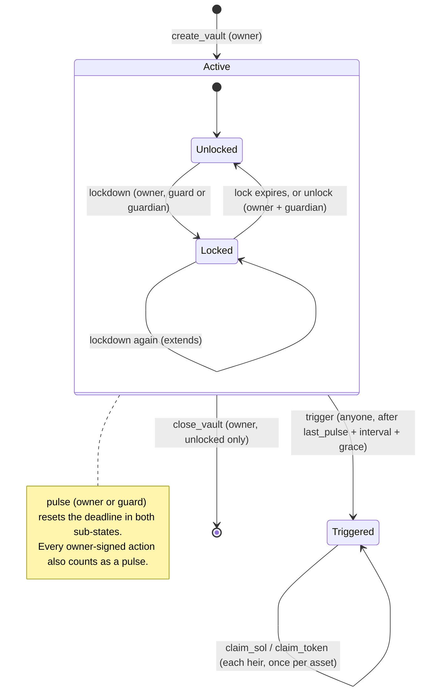

# Deadman

**The self-custody safety net for Seeker.**

Deadman is an Android app for the Solana Seeker plus an Anchor program. You put assets in one on-chain vault, and that vault covers three threats:

| Threat       | What happens                                                                                                                                                                                               |
| ------------ | ---------------------------------------------------------------------------------------------------------------------------------------------------------------------------------------------------------- |
| **Silence**  | If you stop checking in, a dead-man switch opens the vault to your heirs. They receive fixed shares.                                                                                                       |
| **Coercion** | A duress PIN looks like a normal unlock. Behind the scenes it signs `lockdown` with the device guard key, and no wallet prompt appears. Withdrawals and policy changes stay frozen until the lock expires. |
| **Loss**     | A lost or stolen phone holds only the guard key, which cannot move funds. You rotate it from your restored wallet. A guardian can freeze the vault while the phone is missing.                             |

You check in with a daily **Pulse**: one biometric touch, about 3 seconds, and no wallet prompt. It resets the switch and adds to an on-chain streak. With **Family Circle**, your heirs and guardian can see your liveness ("checked in 2h ago"), so they have a reason to open the app too.

> **Status: unaudited hackathon build.** It runs on devnet only. Do not put real funds in it.

## Why it is different

Dead-man switches and inheritance vaults are a crowded idea on Solana. Colosseum's project archive lists 15+ near-identical projects, and none of them won an award ([evidence](docs/JUDGING.md#prior-art-colosseum-copilot)). The closest one, [SolGuard](https://colosseum.com/projects/explore/solguard-5), already has heartbeat inheritance, a duress key and defend-only guardians. Its interface is a web app.

Deadman's bet is not a new mechanism. It is execution on the phone:

- **Guard key.** Each install generates a hot key in secure storage behind biometrics. On-chain, this key may only `pulse` and `lockdown`; it can never withdraw. Daily check-ins and the duress path therefore need no Seed Vault prompt, and a stolen guard key cannot take funds.
- **Duress is a time-lock, not a decoy.** The duress PIN does not send funds to a "safe wallet" that the attacker could demand next. It freezes the vault for `lock_secs`. An early unlock needs the owner and the guardian to sign together.
- **A daily habit and a social loop.** The Pulse streak and Family Circle answer the question every proof-of-life app faces: "why open it when nothing is happening?"
- **Seeker-native.** The owner key stays in the Seed Vault and is reached through Mobile Wallet Adapter. Distribution is the Solana dApp Store, and Plus is paid in SKR.

## How it works



- **Active, unlocked.** The owner can deposit, withdraw and edit the policy. The guard key pulses every day.
- **Active, locked (overlay).** `withdraw_sol`, `withdraw_token`, `update_policy` and `close_vault` fail with `VaultLocked`. `pulse`, `set_guard`, `subscribe` and `trigger` still work. A lockdown does not reset the switch, so inheritance keeps working during a lock.
- **Triggered.** Anyone can call `trigger` once `now > last_pulse + interval_secs + grace_secs`. Heirs are the natural callers, and there is no keeper network. A trigger cannot be undone. The SOL balance is snapshotted at trigger. Each token mint is snapshotted at the first claim for that mint. Each heir then claims `bps / 10000` of the snapshot. The protocol success fee (`fee_bps`, capped at 100 = 1% in the program) is taken from each share.

### Instructions

| Instruction      | Signer(s)                 | Effect                                                                                                             |
| ---------------- | ------------------------- | ------------------------------------------------------------------------------------------------------------------ |
| `init_config`    | program upgrade authority | Creates the `Config` PDA: treasury, SKR mint, Plus price, `fee_bps` (at most 100).                                 |
| `set_config`     | `config.admin`            | Updates the same fields. The fee cap is enforced again.                                                            |
| `create_vault`   | owner                     | Creates `Vault` PDA `["vault", owner]` with the guard key, the durations and the heirs. Counts as the first pulse. |
| `update_policy`  | owner                     | Replaces durations, heirs and the guardian (a guardian requires Plus). Blocked while locked.                       |
| `set_guard`      | owner                     | Rotates the guard key. **Allowed during lockdown.**                                                                |
| `pulse`          | owner or guard            | Resets the switch and updates `streak`, `best_streak` and `total_pulses`.                                          |
| `lockdown`       | owner, guard or guardian  | `locked_until = max(locked_until, now + lock_secs)`. Does not reset the switch.                                    |
| `unlock`         | owner **and** guardian    | Ends a lockdown early.                                                                                             |
| `withdraw_sol`   | owner                     | Withdraws lamports above rent. Blocked while locked.                                                               |
| `withdraw_token` | owner                     | Withdraws from the vault's ATA (SPL Token or Token-2022). Blocked while locked.                                    |
| `close_vault`    | owner                     | Closes the vault and returns its lamports. Blocked while locked. Does not sweep token accounts.                    |
| `trigger`        | anyone                    | Fires an expired switch and snapshots the SOL balance.                                                             |
| `claim_sol`      | heir                      | Pays the heir's share minus the fee. The fee goes to the treasury.                                                 |
| `claim_token`    | heir                      | Same per mint. Tracked in `TokenClaim` PDA `["claim", vault, mint]`.                                               |
| `subscribe`      | owner                     | Pays `plus_price × months` in SKR to the treasury (1 to 12 months).                                                |

There is no deposit instruction. To deposit SOL, send a plain system transfer to the vault PDA. To deposit tokens, transfer them into the vault PDA's associated token account.

### Plans

|             | Free                                     | Deadman Plus (paid in SKR)            |
| ----------- | ---------------------------------------- | ------------------------------------- |
| Heirs       | 1                                        | up to 4                               |
| Guardian    | no                                       | yes (lockdown + co-sign early unlock) |
| Success fee | `fee_bps` (≤1%), taken from heir payouts | same                                  |

Duration bounds enforced on-chain: interval 60 s to 366 days, grace 60 s to 90 days, lock 60 s to 30 days. The 60-second minimums exist so the switch can be demoed live.

Full account, trust and threat models: [docs/ARCHITECTURE.md](docs/ARCHITECTURE.md).

## Repository layout

```
onchain/                 Anchor workspace
  programs/deadman/src/  program (lib.rs, state.rs, instructions/{config,vault,funds}.rs)
  programs/deadman/tests LiteSVM integration tests
lib/                     Flutter app
  core/config.dart       cluster, RPC, program id, SKR mint
  solana/deadman_api.dart  program client contract (tx builders, guard-key actions)
  wallet/wallet_bridge.dart  MWA contract (authorize, signTransactions)
  state/, ui/            Riverpod state and screens
android/                 Android host app (app.deadman.seeker), Kotlin MWA bridge to Seed Vault Wallet
docs/                    judging report, architecture, pitch outline, demo script
```

## Build and test

Toolchain: Rust 1.89.0 (pinned in `onchain/rust-toolchain.toml`), Anchor 1.1.2, Flutter with Dart SDK ^3.13.

```bash
# Program
cd onchain
anchor build                        # writes target/deploy/deadman.so
cargo fmt --all
cargo clippy -- -W clippy::all
cargo test                          # LiteSVM tests load target/deploy/deadman.so, so build first

# App
cd ..
flutter pub get
flutter build apk --dart-define=SKR_MINT=<devnet SKR stand-in mint>
```

The integration tests in `onchain/programs/deadman/tests/test_deadman.rs` cover these cases: config gated to the upgrade authority, guard pulses and day streaks, duress lockdown with guard rotation, the guard being unable to move funds, free versus Plus limits, guardian lock and co-signed unlock, the switch firing only after the deadline, a pulse preventing a trigger, and pro-rata token claims.

**Devnet program ID:** `ACHVLMoLDM3YPpGbNST4cZW4Tf2jx6nzJGuusyLJHofL`. Check that it is deployed with `solana program show ACHVLMoLDM3YPpGbNST4cZW4Tf2jx6nzJGuusyLJHofL --url devnet`.

## Security notes

- **Unaudited.** This is a hackathon build. Nobody outside the team has reviewed it. It has not been fuzzed, and it is not a verifiable build yet.
- **Single-key admin.** `init_config` can only be called by the program's upgrade authority, and that key also controls upgrades. Until the authority moves to a multisig or the program is frozen, that one key can change the program.
- **Only vaulted assets are covered.** Funds left in your Seed Vault wallet are not protected by the switch or by lockdown.
- **Owner-key compromise is out of scope.** There is no on-chain owner rotation. Someone who holds your seed can withdraw while the vault is unlocked.
- **Known limitations** (details in [ARCHITECTURE.md](docs/ARCHITECTURE.md#known-limitations)):
  - A guardian can keep extending a lockdown while Plus is active; guardian lockdowns stop working once Plus lapses, so the worst case is the prepaid Plus time plus one lock period.
  - `close_vault` does not sweep token accounts.
  - SOL deposited after `trigger` is not distributed.
  - Each claimed mint needs a treasury token account.
- Program hygiene: canonical bumps are stored, arithmetic is checked, and there is no `unwrap()` in program code. Every instruction validates the signer against the vault's stored roles.

## Roadmap

- **Now (hackathons):** Solana Mobile CLOCK IN (APK, GitHub, demo video and deck, due 2026-10-08) and the Colosseum Crypto World's Fair, Solana track (due 2026-10-12).
- **Before mainnet:** external audit, a multisig upgrade authority, a verifiable build, a fix for guardian removal during lockdown, a token sweep in `close_vault`, and a Seeker Genesis Token check for Seeker-only perks.
- **Cloak private payouts to heirs.** Heirs claim without linking the estate to their main wallet publicly. Cloak's SDK is TypeScript only today, so this needs a bridge or a backend.
- **Zcash shielded inheritance.** A shielded version of the switch for ZEC holders.
- **DAO signer recovery.** The same switch applied to multisig signers: a signer who stays silent for N months is replaced by a pre-agreed backup.

## License

Not yet chosen.
