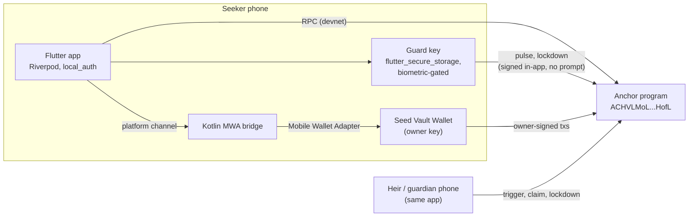

# Deadman Architecture

Status as of 2026-10-02: unaudited hackathon build, devnet only. Program source: `onchain/programs/deadman/src/`. Every rule below can be traced to that code; file references are given where useful.

## Components

- **Owner key.** This is the user's Seed Vault account. The app reaches it only through `WalletBridge` (`lib/wallet/wallet_bridge.dart`), which is a Mobile Wallet Adapter client implemented in Kotlin. Every owner action opens the wallet for approval. The app builds unsigned transactions (`DeadmanApi.build*`), the wallet signs them, and the app submits them.
- **Guard key.** An Ed25519 keypair generated on the device and kept in `flutter_secure_storage` behind `local_auth`. `create_vault` registers it. At setup the app funds it with 0.01 SOL (`AppConfig.guardFundingLamports`) to pay pulse fees. `DeadmanApi.pulseWithGuard` and `lockdownWithGuard` sign and send directly, with no wallet prompt.
- **Reminders.** `workmanager` and local notifications schedule Pulse reminders. Android Doze makes them inexact, which is acceptable because the on-chain deadline is the source of truth.
- **Family Circle.** `DeadmanApi.fetchWatchedVaults(wallet)` returns every vault where the wallet is an heir or the guardian. The app shows `last_pulse`, the streak and the time left until the deadline. This reads only public on-chain data.

## Account model

| Account         | Seeds                    | Owner         | Holds                                                                                                                                                                                                                                                                      |
| --------------- | ------------------------ | ------------- | -------------------------------------------------------------------------------------------------------------------------------------------------------------------------------------------------------------------------------------------------------------------------- |
| `Config`        | `["config"]`             | program       | `admin`, `treasury`, `skr_mint`, `plus_price` (SKR base units per 30 days), `fee_bps` (≤ 100), `bump`                                                                                                                                                                      |
| `Vault`         | `["vault", owner]`       | program       | roles (`owner`, `guard`, `guardian: Option`), `interval_secs`, `grace_secs`, `lock_secs`, `last_pulse`, `locked_until`, `plus_until`, `triggered_at`, `sol_at_trigger`, `total_pulses`, `streak`, `best_streak`, `status`, `heirs` (≤ 4: wallet, bps, claimed_sol), `bump` |
| Vault token ATA | ATA(vault PDA, mint)     | token program | Vaulted SPL / Token-2022 balances. The vault PDA signs transfers out of it.                                                                                                                                                                                                |
| `TokenClaim`    | `["claim", vault, mint]` | program       | `amount_at_snapshot`, `claimed_mask` (one bit per heir index), `initialized`, `bump`. The first claimant creates and pays for it.                                                                                                                                          |

- There is **one vault per owner**, because the PDA is seeded by the owner key.
- **SOL lives directly on the `Vault` account** as lamports above rent. Withdrawals and claims move lamports with `sub_lamports` / `add_lamports`, and the withdrawable balance always excludes the rent-exempt minimum.
- **Deposits have no instruction.** Anyone can send SOL to the vault PDA or tokens to its ATA.
- **Bumps.** Canonical bumps are stored at init (`Config.bump`, `Vault.bump`, `TokenClaim.bump`) and reused in seeds constraints.
- **Heir validation** (`Vault::apply_policy`):
  - There is at least one heir. The free plan allows 1 and Plus allows up to 4.
  - Every heir has `bps > 0`, and the shares sum to exactly 10 000.
  - No heir is the default key, the owner or the guard, and no heir appears twice.
  - A guardian requires Plus, and must not be the owner, the guard or an heir.
- **Deadline:** `last_pulse + interval_secs + grace_secs`, with checked arithmetic.
- **Streak** (`Vault::record_pulse`): calendar days are UTC (`now / 86400`). A pulse on the next day adds 1 to the streak. A pulse on the same day leaves it unchanged. A gap of more than one day resets it to 1.

## Lifecycle

1. **Create.** The owner calls `create_vault`. It counts as the first pulse. The client sends this instruction in the same transaction as the guard-funding transfer and an optional deposit.
2. **Active, unlocked.** The guard key or the owner pulses. Every owner-signed mutation also records a pulse: `update_policy`, `set_guard`, `withdraw_*` and `unlock`. `subscribe` does not.
3. **Active, locked.** This state is an overlay on Active, entered with `lockdown`.
   - Blocked: `withdraw_sol`, `withdraw_token`, `update_policy`, `close_vault`.
   - Allowed: `pulse`, `set_guard`, `subscribe`, `lockdown` (which can only extend the lock) and `trigger`.
   - The lock ends when `locked_until` passes, or when `unlock` is signed by the owner and the guardian together.
4. **Triggered.** Once the deadline passes, anyone can call `trigger`. It records `sol_at_trigger` and `triggered_at`. The transition is one-way: no instruction returns the vault to Active.
5. **Claims.** Each heir calls `claim_sol` once. They can call `claim_token` once per mint. The token snapshot is taken at the first claim for that mint. For each heir:
   - `gross = snapshot × bps / 10 000`
   - `fee = gross × fee_bps / 10 000`
   - The heir receives `gross − fee` and the treasury receives `fee`. Integer rounding dust stays in the vault.
6. **Close.** An Active, unlocked vault can be closed by its owner, which returns all lamports.

## Trust model

| Role         | Key                                                                  | Can                                                                                                                                           | Cannot                                                                                                                      |
| ------------ | -------------------------------------------------------------------- | --------------------------------------------------------------------------------------------------------------------------------------------- | --------------------------------------------------------------------------------------------------------------------------- |
| **Owner**    | Seed Vault account, via MWA                                          | Everything on their vault: withdraw, edit the policy, rotate the guard, pulse, lock down, close, subscribe. `unlock` also needs the guardian. | Unlock early alone; withdraw or edit the policy while locked; undo a trigger; claim as an heir.                             |
| **Guard**    | Device key in secure storage + biometrics                            | `pulse`, `lockdown`                                                                                                                           | Move funds, change the policy, unlock, rotate itself.                                                                       |
| **Guardian** | A trusted contact's wallet (Plus only)                               | `lockdown`; co-sign `unlock` with the owner                                                                                                   | Move funds, change the policy, pulse, unlock alone.                                                                         |
| **Heir**     | Heir's wallet, listed in `Vault.heirs`                               | `trigger` (like anyone else); after a trigger, `claim_sol` / `claim_token` for their own share, once per asset                                | Trigger before the deadline (`StillAlive`); claim another heir's share; claim twice.                                        |
| **Anyone**   | Any signer                                                           | `trigger` after the deadline; deposit into any vault                                                                                          | Everything else.                                                                                                            |
| **Admin**    | `Config.admin`, which must be the upgrade authority at `init_config` | `set_config`: treasury, SKR mint, Plus price, `fee_bps` up to the 1% cap. As upgrade authority, ship program upgrades.                        | Through instructions: touch any vault, raise the fee above 100 bps. (An upgrade can change any rule; see the threat model.) |

## Threat model

| Threat                                              | What the attacker gets                                                            | What stops them                                                                                                                                                                                                                                                                                                                                                                                            | Residual risk                                                                                                                                                                                                                                                                                                               |
| --------------------------------------------------- | --------------------------------------------------------------------------------- | ---------------------------------------------------------------------------------------------------------------------------------------------------------------------------------------------------------------------------------------------------------------------------------------------------------------------------------------------------------------------------------------------------------- | --------------------------------------------------------------------------------------------------------------------------------------------------------------------------------------------------------------------------------------------------------------------------------------------------------------------------- |
| **Thief with an unlocked phone**                    | The Deadman app and, if they pass biometrics, the guard key.                      | The guard can only `pulse` and `lockdown` (constraints on `Pulse` and `Lockdown`). Moving funds needs an owner signature, and that goes through the Seed Vault Wallet's own approval step. The owner, from a restored wallet, or the guardian can lock the vault. Then `set_guard` revokes the device key, and it works even during a lock.                                                                | If the thief also gets past Seed Vault approval, the owner key is compromised. There is no on-chain owner rotation, and only a lockdown slows the withdrawal. Assets outside the vault are not covered.                                                                                                                     |
| **Coercion ("wrench attack")**                      | The victim, in person, forced to open the app.                                    | The duress PIN makes the guard sign `lockdown` silently, with no wallet prompt. After that, `withdraw_*`, `update_policy` (so heirs cannot be redirected) and `close_vault` fail with `VaultLocked` for `lock_secs`. Only the owner and the guardian together can lift the lock early. Forcing a `set_guard` gains the attacker nothing. Tested in `duress_lockdown_freezes_funds_but_not_guard_rotation`. | The lock is visible on-chain, so the defense is time, not secrecy, like a time-lock safe. `lock_secs` is at most 30 days. Funds outside the vault are exposed. A victim forced to approve a raw withdrawal before ever opening Deadman is not protected. A guardian under coercion could co-sign an unlock.                 |
| **Stolen guard key**                                | `pulse` and `lockdown`.                                                           | It cannot move funds or change the policy (test: `guard_cannot_move_funds`). The owner rotates it with `set_guard`, which works during a lock. After rotation the old key is rejected.                                                                                                                                                                                                                     | Until rotation, the thief can freeze the vault, and the lock persists until `locked_until` because rotation does not clear it. The thief can also keep pulsing, which delays inheritance if the owner is dead and nobody rotates the key.                                                                                   |
| **Malicious heir**                                  | Public vault state, so they know the exact deadline. Can call `trigger`.          | `trigger` reverts with `StillAlive` until `last_pulse + interval + grace`. Claims are capped at the heir's own `bps` and limited to one per asset (`claimed_sol`, `claimed_mask`).                                                                                                                                                                                                                         | Triggering cannot be undone. An owner who misses the interval and the whole grace period loses control to the heirs at the agreed shares. Mitigations: grace period, reminders, and liveness shown to the Family Circle.                                                                                                    |
| **Dead or incapacitated owner** (the intended path) | Nothing to attack. No pulses arrive.                                              | After the deadline any heir calls `trigger`, then each heir claims. A lockdown does not block `trigger` or claims.                                                                                                                                                                                                                                                                                         | Heirs need SOL for fees, and they pay rent for `TokenClaim` and their own ATAs. `claim_token` needs a treasury token account for that mint. An owner who is incapacitated rather than dead still gets triggered; this is by design. A stolen guard key can delay the switch indefinitely by pulsing.                        |
| **Compromised admin**                               | `set_config`, plus program upgrades through the same key (the upgrade authority). | Through `set_config` the fee cannot exceed 100 bps (`FeeTooHigh`), and no config field can move vault funds.                                                                                                                                                                                                                                                                                               | The fee is read at claim time, so raising it within the cap also affects vaults that were already triggered. Treasury and SKR mint redirection affects future fees and subscriptions. **A malicious upgrade can do anything.** Mitigation plan: a multisig upgrade authority, verifiable builds, then freezing the program. |

## Known limitations

These are open items in the current code. They are listed so reviewers do not have to rediscover them.

1. **A guardian can extend a lockdown while Plus is active.** The lock only extends, and `update_policy` (the only way to remove a guardian) is blocked while locked, so that coercion cannot force the guardian's removal. Guardian lockdowns require an active Plus subscription (`PlusRequired` otherwise), which bounds a rogue guardian to the prepaid Plus time plus one `lock_secs`. Inheritance is unaffected: `pulse` and `trigger` still work.
2. **`close_vault` does not check or sweep token accounts.** If tokens are still in the vault's ATAs when it closes, the owner can recover them by re-creating the vault, since the PDA is the same, and then calling `withdraw_token`.
3. **SOL that arrives after `trigger`** is not part of `sol_at_trigger` and cannot be claimed. Tokens that arrive after a mint's first claim are not part of that mint's snapshot either.
4. **The guardian cannot be rotated while the vault is locked.** This follows from point 1.
5. **Owner-key compromise and loss.** The program has no owner rotation. If both the seed and the phone are lost, the switch eventually pays the heirs. You can list a separate cold wallet of your own as an heir to use this as a last-resort recovery path.
6. **Not audited, fuzzed or CU-profiled.** No verifiable build has been published yet.
