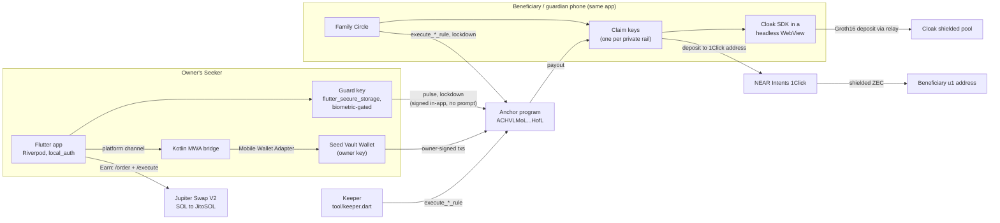

# Deadman Architecture

Status as of 2026-10-02: unaudited hackathon build. The program runs on devnet; the private rails and Earn need a mainnet build (`--dart-define=CLUSTER=mainnet-beta`). Program source: `onchain/programs/deadman/src/`, IDL: `onchain/target/idl/deadman.json`. Every on-chain rule below can be traced to that code; file references are given where useful. A plain-language overview is in [HOW_IT_WORKS.md](HOW_IT_WORKS.md).

## Components

- **Owner key.** This is the user's Seed Vault account. The app reaches it only through `WalletBridge` (`lib/wallet/wallet_bridge.dart`), a Mobile Wallet Adapter client implemented in Kotlin. Every owner action opens the wallet for approval. The app builds unsigned transactions (`DeadmanApi.build*`), the wallet signs them, and the app submits them.
- **Guard key.** An Ed25519 keypair generated on the device and kept in `flutter_secure_storage` behind `local_auth`. `create_vault` registers it. At setup the app funds it with 0.01 SOL (`AppConfig.guardFundingLamports`) to pay pulse fees. `DeadmanApi.pulseWithGuard` and `lockdownWithGuard` sign and send directly, with no wallet prompt.
- **Claim keys.** On a beneficiary's phone, Security → Receive privately creates one Ed25519 key per private rail (`SecureStore.saveClaim`) and stores it with the beneficiary's private destination. The app shares it as a claim code, `cloak:<address>` or `zcash:<address>`, which the owner pastes into a tier. Changing the destination keeps the key, so codes already shared stay valid.
- **Rails** (`lib/rails/`). `ZcashRoute` routes from a claim key to a `u1` address through 1Click. `CloakRoute` runs `@cloak.dev/sdk` 0.2.5, bundled into `assets/cloak/cloak.js`, inside a `HeadlessInAppWebView` (`cloak_webview_runtime.dart`), because every Cloak deposit needs an on-device Groth16 proof. Both report `available == false` off mainnet.
- **Earn** (`lib/rails/earn_jupiter.dart`). `JupiterEarn` gets an unsigned v0 swap from Jupiter Swap V2 `/order` with an optional `referralAccount`/`referralFee`, and submits the wallet-signed bytes through `/execute`. A second owner transaction then deposits the JitoSOL into the vault's ATA. Nothing in the program calls Jupiter or the stake pool.
- **Keeper** (`tool/keeper.dart`). A loop that fetches every vault (`fetchAllVaults`, a `getProgramAccounts` scan), finds due rules with the same check as the program (`VaultState.canExecute`), and executes them with its own key, at most one rule per vault per sweep.
- **Reminders.** `workmanager` and local notifications schedule Pulse reminders before the next rule is due. Android Doze makes them inexact, which is acceptable because the on-chain clock is the source of truth.
- **Family Circle.** `fetchWatchedVaults` returns every vault where the wallet or one of this device's claim keys is a beneficiary or the guardian. The app shows `last_pulse`, the streak, and each tier that names this device: pending, due, or released with the amount paid. Due tiers get a "Release this tier" button; released private tiers get "Route privately".

## Account model

| Account                | Seeds                             | Owner         | Holds                                                                                                                                                                                                                                                                               |
| ---------------------- | --------------------------------- | ------------- | ----------------------------------------------------------------------------------------------------------------------------------------------------------------------------------------------------------------------------------------------------------------------------------- |
| `Config`               | `["config"]`                      | program       | `admin`, `treasury`, `fee_bps_public` (Solana rail), `fee_bps_private` (Cloak, Zcash), `bump`. Each fee ≤ 500.                                                                                                                                                                      |
| `Vault`                | `["vault", owner]`                | program       | roles (`owner`, `guard`, `guardian: Option`), `interval_secs`, `lock_secs`, `last_pulse`, `locked_until`, `guardian_ready_at`, `total_pulses`, `streak`, `best_streak`, `rules` (≤ 8: `beneficiary`, `rail`, `after_secs`, `mint`, `mode`, `amount`, `executed_at`, `paid`), `bump` |
| Vault token ATA        | ATA(vault PDA, mint)              | token program | Vaulted SPL / Token-2022 balances, including JitoSOL from Earn. The vault PDA signs transfers out of it.                                                                                                                                                                            |
| Beneficiary token ATA  | ATA(beneficiary, mint)            | token program | Created by `execute_token_rule` (`init_if_needed`) at the executor's expense.                                                                                                                                                                                                       |
| Treasury token account | ATA(treasury, mint) in the client | token program | Fee destination for token rules. The program only checks mint and authority (`config.treasury`). The client creates the ATA idempotently in the same transaction.                                                                                                                   |

- There is **one vault per owner**, because the PDA is seeded by the owner key.
- **SOL lives directly on the `Vault` account** as lamports above rent. Withdrawals and SOL payouts move lamports with `sub_lamports` / `add_lamports`, and the withdrawable balance always excludes the rent-exempt minimum.
- **Deposits have no instruction.** Anyone can send SOL to the vault PDA or tokens to its ATA.
- **Bumps.** Canonical bumps are stored at init (`Config.bump`, `Vault.bump`) and reused in seeds constraints.
- **Rule validation** (`Vault::apply_policy`):
  - 1 to 8 rules, sorted by non-decreasing `after_secs`.
  - `interval_secs + 60 ≤ after_secs ≤ 3 × 366 days`, so no rule can fire before a check-in is missed.
  - `Fixed` amounts are > 0; `Percent` amounts are 1 to 10 000 bps.
  - No beneficiary is the default key, the owner or the guard. `Some(default)` is rejected as a mint.
  - The guardian must not be the default key, the owner, the guard or any beneficiary. `set_guard` applies the mirror checks to a new guard.
  - The same beneficiary may appear in several rules.
- **Due time:** `rule_due_at = last_pulse + after_secs`, with checked arithmetic. A rule is executable when `now > rule_due_at`, it has not executed, its asset matches the instruction, and every earlier rule for the same asset has executed (`Vault::check_executable`).
- **Amounts** (`rule_gross`, `split_fee`): `Fixed` pays `min(amount, available)`; `Percent` pays `available × amount / 10 000`, where `available` is the withdrawable lamports or the vault ATA balance at execution time. `fee = gross × fee_bps / 10 000`, computed in `u128`. Integer rounding dust stays in the vault.
- **Streak** (`Vault::record_pulse`): calendar days are UTC (`now / 86400`). A pulse on the next day adds 1 to the streak. A pulse on the same day leaves it unchanged. A gap of more than one day resets it to 1.

## Lifecycle

1. **Create.** The owner calls `create_vault`. It counts as the first pulse. The client sends it in the same transaction as the guard-funding transfer and an optional deposit, so one wallet approval arms the vault.
2. **Armed, unlocked.** The guard key or the owner pulses. Every owner-signed mutation also records a pulse: `update_policy`, `set_guard`, `withdraw_*` and `unlock`. Rule execution and `lockdown` do not.
3. **Armed, locked.** An overlay entered with `lockdown`.
   - Blocked: `withdraw_sol`, `withdraw_token`, `update_policy`, `close_vault`.
   - Allowed: `pulse`, `set_guard`, `lockdown` (which can only extend the lock) and both `execute_*_rule` instructions.
   - The lock ends when `locked_until` passes, or when `unlock` is signed by the owner and the guardian together.
   - A guardian lockdown sets `guardian_ready_at = locked_until + lock_secs`. Until then the guardian cannot lock again, which leaves the owner an unlocked window of at least `lock_secs` to remove a rogue guardian with `update_policy`. The owner and guard are not rate-limited.
4. **Release.** Once `now > last_pulse + after_secs`, anyone may call `execute_sol_rule` or `execute_token_rule` with the rule index. For each executed rule:
   - The beneficiary account passed in must equal `rule.beneficiary`, and the treasury must equal `config.treasury`.
   - The beneficiary receives `gross − fee`; the treasury receives `fee` at the rule's rail rate.
   - SOL rules: if the fee would leave a brand-new treasury account below rent, the fee goes to the beneficiary instead. If the net payout would leave a brand-new beneficiary account below rent, nothing moves and the rule is marked executed with `paid = 0`, so later rules are not blocked.
   - Token rules on a private rail: if the claim key holds less than 0.003 SOL and the vault has at least that much withdrawable, the vault sends it 0.003 SOL (`PRIVATE_GAS_STIPEND`).
   - `executed_at` and `paid` are recorded, and a `RuleExecuted` event logs the rail, amount, fee and executor.
5. **Pulse after a partial release.** The clock restarts for every pending rule; executed rules stay executed. The owner can withdraw what is left as normal.
6. **Plan change.** `update_policy` replaces every rule, and all of them start pending, including tiers that already paid out.
7. **Private routing** (off-chain, beneficiary's app). After a private tier releases SOL to a claim key, "Route privately" quotes and executes the route, keeping 0.001 SOL on the claim key for fees:
   - Zcash: a signed 1Click quote to the `u1` address with `refundTo` = the claim key, a transfer to the one-time deposit address, then status polling.
   - Cloak: the WebView derives the claim key's Cloak identity, fetches a relay risk quote, proves and deposits, then sends to the destination. A re-run after a crash detects the earlier deposit and does not deposit twice.
8. **Close.** An unlocked vault can be closed by its owner, which returns all lamports.

## Trust model

| Role                | Key                                                                  | Can                                                                                                                                 | Cannot                                                                                                                              |
| ------------------- | -------------------------------------------------------------------- | ----------------------------------------------------------------------------------------------------------------------------------- | ----------------------------------------------------------------------------------------------------------------------------------- |
| **Owner**           | Seed Vault account, via MWA                                          | Everything on their vault: withdraw, replace the plan, rotate the guard, pulse, lock down, close. `unlock` also needs the guardian. | Unlock early alone; withdraw or change the plan while locked; un-execute a rule; be a beneficiary of their own vault.               |
| **Guard**           | Device key in secure storage + biometrics                            | `pulse`, `lockdown`                                                                                                                 | Move funds, change the plan, unlock, rotate itself.                                                                                 |
| **Guardian**        | A trusted contact's wallet                                           | `lockdown`, at most once per `lock + lock_secs` cycle; co-sign `unlock` with the owner                                              | Move funds, change the plan, pulse, unlock alone, lock again during the cooldown.                                                   |
| **Beneficiary**     | A wallet (Solana rail) or a claim key (private rails)                | Receive what its rules pay; execute any due rule like anyone else                                                                   | Execute before the due time (`RuleNotDue`) or out of order (`RuleOutOfOrder`); receive another rule's payout; execute a rule twice. |
| **Executor/keeper** | Any signer; normally the protocol keeper                             | Execute due rules; pays fees and token-account rent                                                                                 | Choose the destination or the amount; both come from the rule and the vault balance.                                                |
| **Anyone**          | Any signer                                                           | Execute due rules; deposit into any vault                                                                                           | Everything else.                                                                                                                    |
| **Admin**           | `Config.admin`, which must be the upgrade authority at `init_config` | `set_config`: treasury and both fees up to the 5% cap. As upgrade authority, ship program upgrades.                                 | Through instructions: touch any vault, set a fee above 500 bps. (An upgrade can change any rule; see the threat model.)             |
| **Rail operators**  | 1Click / NEAR Intents solvers, Cloak relay and program, Jupiter      | Delay, refund or decline a route or swap; observe the claim key, destination, amounts and IP address                                | Touch the vault, change a rule, or take funds before they reach the claim key.                                                      |

## Threat model

| Threat                                              | What the attacker gets                                                                     | What stops them                                                                                                                                                                                                                                                                                                                                                                             | Residual risk                                                                                                                                                                                                                                                                                                                                         |
| --------------------------------------------------- | ------------------------------------------------------------------------------------------ | ------------------------------------------------------------------------------------------------------------------------------------------------------------------------------------------------------------------------------------------------------------------------------------------------------------------------------------------------------------------------------------------- | ----------------------------------------------------------------------------------------------------------------------------------------------------------------------------------------------------------------------------------------------------------------------------------------------------------------------------------------------------- |
| **Thief with an unlocked phone**                    | The Deadman app and, if they pass biometrics, the guard key. Any claim keys on that phone. | The guard can only `pulse` and `lockdown` (constraints on `Pulse` and `Lockdown`). Moving vault funds needs an owner signature, and that goes through the Seed Vault Wallet's own approval step. The owner, from a restored wallet, or the guardian can lock the vault. `set_guard` revokes the device key, even during a lock.                                                             | If the thief also gets past Seed Vault approval, the owner key is compromised; only a lockdown slows the withdrawal. Claim keys are ordinary hot keys: funds already released to them can be taken.                                                                                                                                                   |
| **Coercion ("wrench attack")**                      | The victim, in person, forced to open the app.                                             | The duress PIN makes the guard sign `lockdown` silently. Under that session, deposit, withdraw, plan edits and Earn fail with a fake "Seed Vault timed out" instead of revealing the lock. On-chain, `withdraw_*`, `update_policy` (so beneficiaries cannot be redirected) and `close_vault` fail with `VaultLocked` for `lock_secs`. Tested in `duress_lockdown_freezes_funds_and_policy`. | The lock is visible on-chain, so the defense is time, not secrecy. `lock_secs` is at most 30 days. Funds outside the vault are exposed. A victim forced to approve a raw withdrawal before ever opening Deadman is not protected. A guardian under coercion could co-sign an unlock.                                                                  |
| **Stolen guard key**                                | `pulse` and `lockdown`.                                                                    | It cannot move funds or change the plan (test: `guard_cannot_move_funds`). The owner rotates it with `set_guard`, which works during a lock.                                                                                                                                                                                                                                                | Until rotation, the thief can keep the vault frozen (guard lockdowns are not rate-limited) and can keep pulsing, which delays every rule indefinitely if the owner is dead and nobody rotates the key.                                                                                                                                                |
| **Rogue guardian**                                  | `lockdown`.                                                                                | `guardian_ready_at`: after a guardian lock expires, the guardian must wait `lock_secs` before locking again. The owner uses that unlocked window to remove them (test: `guardian_lockdown_is_rate_limited_and_removable`).                                                                                                                                                                  | The owner loses withdrawals for up to one `lock_secs` per cycle and must act inside the window. Rules keep executing during a lock.                                                                                                                                                                                                                   |
| **Malicious beneficiary or executor**               | Public vault state, so the exact due time of every rule. Can call `execute_*_rule`.        | Execution reverts with `RuleNotDue` while `now ≤ last_pulse + after_secs`, and with `RuleOutOfOrder` if an earlier rule for the asset is pending. The beneficiary and treasury accounts are pinned. A rule executes once.                                                                                                                                                                   | Executing a rule is final. An owner who stays silent past a tier's delay loses that tier, even if they were only travelling.                                                                                                                                                                                                                          |
| **Dead or incapacitated owner** (the intended path) | Nothing to attack. No pulses arrive.                                                       | Each tier becomes due in turn; the keeper or a beneficiary executes it. A lockdown does not block execution (test: `lockdown_does_not_stop_inheritance`).                                                                                                                                                                                                                                   | An incapacitated owner is treated like a dead one; this is by design. Assets no rule reaches stay in the vault. A stolen guard key can delay everything by pulsing.                                                                                                                                                                                   |
| **Claim-key loss**                                  | Nothing to an attacker; the beneficiary loses access.                                      | The claim key lives in Android Keystore-backed storage on the beneficiary's phone. Funds stay on it, not in a third party, until routed, and 1Click refunds return to it.                                                                                                                                                                                                                   | There is no backup or export yet. If the phone is lost or the app is reset before routing, funds already on the claim key are gone. If it is lost before release, the rule will still pay the dead key unless the owner, while alive, replaces the claim code with `update_policy`.                                                                   |
| **Keeper failure**                                  | Nothing to an attacker; payouts are late.                                                  | Execution is permissionless. Beneficiaries can release a due tier from Family Circle, and anyone can run `tool/keeper.dart`. A due rule stays due until executed or reset by a pulse.                                                                                                                                                                                                       | Releasing a private tier from the beneficiary's own wallet makes that wallet the public executor, which links it to the payout; a claim key has no SOL to pay fees until something is paid to it. The keeper scans with `getProgramAccounts`, which needs an indexer at mainnet scale.                                                                |
| **Rail operator risk**                              | 1Click/NEAR, Cloak's relay, or Jupiter misbehaving, going down, or holding funds.          | The program never depends on them: on-chain, every rail ends at a Solana key the beneficiary controls. 1Click quotes are signature-checked and refund to the claim key; Cloak re-runs are idempotent; Jupiter orders are checked for mints, amount and signer before signing.                                                                                                               | 1Click can hold funds for compliance (one hold was reported in 2026) and its explorer links deposit address to `u1`. Cloak's relay is required for deposits, holds the viewing key and screens the claim key. Jupiter has deprecated two APIs in a row. Upgrades of Cloak's program (3-of-4 multisig) or the Jito stake pool are outside our control. |
| **Earn position risk**                              | JitoSOL in the vault.                                                                      | It is held as a plain token; the program has no CPI, so an Earn failure cannot break vault logic.                                                                                                                                                                                                                                                                                           | JitoSOL can trade below its pool rate; beneficiaries of a JitoSOL rule receive JitoSOL with that exposure. A 50 bps swap fee costs about 38 days of yield at 4.81% APY.                                                                                                                                                                               |
| **Compromised admin**                               | `set_config`, plus program upgrades through the same key (the upgrade authority).          | Through `set_config`, neither fee can exceed 500 bps (`FeeTooHigh`), the treasury cannot be zero, and no config field can move vault funds.                                                                                                                                                                                                                                                 | Fees are read at execution, so a raise within the cap applies to every pending rule. Treasury redirection affects future fees. **A malicious upgrade can do anything.** Mitigation plan: a multisig upgrade authority, verifiable builds, then freezing the program.                                                                                  |

## Known limitations

These are open items in the current code. They are listed so reviewers do not have to rediscover them.

1. **Unreached funds are stranded.** Percentages are taken from the balance at execution time, and nothing forces the plan to cover 100% of every asset. Whatever no rule pays out stays in the vault if the owner never returns. The same applies to a SOL tier skipped as dust (`paid = 0`) when it is the last rule for SOL.
2. **Percent tiers depend on execution order and time.** Deposits, Earn swaps or earlier tiers change the base that a later percentage applies to. The keeper executes one rule per vault per sweep for this reason.
3. **`update_policy` re-arms everything.** Replacing the plan resets `executed_at` on every rule, including tiers that already paid. The app always edits the full plan, so the owner sees this, but a released tier left in the plan will pay again.
4. **The guardian can only be removed while unlocked.** `update_policy` is blocked during any lockdown. The guardian cooldown guarantees an unlocked window, but a stolen guard key (not rate-limited) can deny it until the owner rotates the guard.
5. **`close_vault` does not check or sweep token accounts.** Tokens left in the vault's ATAs can be recovered by re-creating the vault (same PDA) and calling `withdraw_token`.
6. **Private routing covers SOL only in the app.** The program pays SPL tokens to claim keys and sends the gas stipend, and `ZcashRoute`/`CloakRoute` accept USDC and USDT, but the "Route privately" action only forwards SOL today.
7. **Cloak destinations.** A plain Solana address (Cloak private send) works. A `cloak:` shielded-transfer destination cannot be received yet, because beneficiary-side note scanning and unshielding are not built.
8. **Zcash destinations.** Only unified `u1` addresses are accepted; the app rejects anything else when saving the receiving profile. A `u1` with a transparent receiver may be paid transparently, so beneficiaries should use a shielded-only `u1`.
9. **No real-funds run yet** of either private rail or of Earn. Cloak's fee reserves are estimates, and Cloak proving time on the Seeker is unmeasured.
10. **Claim keys have no backup.** One key per rail per device; resetting the app wipes it.
11. **Keeper and client scale.** The keeper and Family Circle scan every vault with `getProgramAccounts`. The Dart client rejects Token-2022 mints, although the program supports them.
12. **Owner-key compromise and loss.** The program has no owner rotation. If both the seed and the phone are lost, the plan eventually pays the beneficiaries. Listing a separate cold wallet of your own as a beneficiary turns this into a last-resort recovery path.
13. **Not audited or fuzzed.** Compute units are measured only by the LiteSVM `compute_unit_profile` test (it asserts `execute_sol_rule` stays under 30 000 CU). No verifiable build has been published yet.
