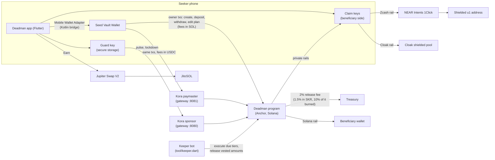
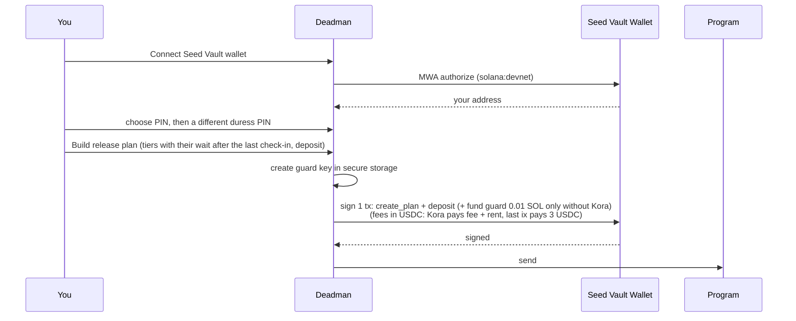
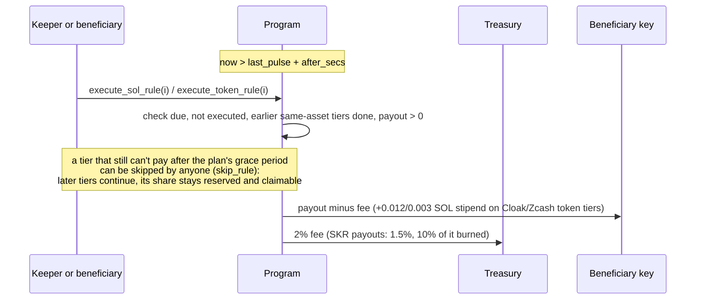

# How Deadman works

Every design choice, technology and user flow in the current build (updated 2026-10-08: no subscription; a 2% release fee, 1.5% for payouts in SKR with 10% of that fee burned, free withdrawals; duress decoy wallet, Boney skins). Research behind the rails, with sources: [`docs/research/`](research/).

**In one paragraph:** Deadman is a vault on Solana that you control from your Seeker. You check in with a 3-second fingerprint "pulse". You write a _release plan_: tiers like "after 30 days of silence, send 10% of my SOL to my spouse; after 90 days, send everything else to my kids as shielded Zcash". If you stop checking in, the tiers fire in order. If someone forces you to open the app, a duress PIN shows a convincing fake wallet while it silently freezes the real vault. Next to these inheritance plans you can open _vesting plans_ that release SOL or USDC to someone in installments (monthly by default) over time, whether you check in or not. Plans hold SOL and USDC, and an owner with no SOL at all can pay network fees in USDC. Deadman charges nothing to use and has no subscription: it takes 2% only when a tier or vesting installment actually releases funds, or 1.5% when the payout is in SKR (10% of that SKR fee is burned); withdrawing, closing and revoking are free. It also earns on the optional staking yield path.

---

## 1. System map



The Solana program is the only component that holds funds. Everything else signs, schedules, or routes.

---

## 2. Technologies and why each was chosen

| Layer          | Technology                                                                      | Why this, not something else                                                                                                                                                                                                                                                                            |
| -------------- | ------------------------------------------------------------------------------- | ------------------------------------------------------------------------------------------------------------------------------------------------------------------------------------------------------------------------------------------------------------------------------------------------------- |
| Chain          | **Solana**                                                                      | Seeker-native. A daily pulse costs ~0.000005 SOL, so frequent check-ins are free in practice.                                                                                                                                                                                                           |
| Program        | **Anchor 1.1.2** (Rust)                                                         | Declarative account checks (signer, PDA seeds, `has_one`) remove the most common Solana bugs. It also generates the IDL the app encodes against. Pinocchio wasn't needed: the most expensive instruction uses ~14.5k compute units.                                                                     |
| Program tests  | **LiteSVM**                                                                     | Runs the real compiled program in-process, with clock control to simulate "30 days of silence" in a millisecond. 42 tests (`onchain/programs/deadman/tests/test_deadman.rs`).                                                                                                                           |
| Lint gate      | **Solana `program_autofixer`**                                                  | Static security pass. It found no issues on v2.                                                                                                                                                                                                                                                         |
| App            | **Flutter 3.47** + Material 3                                                   | Your requirement. One codebase, ports later to any Android phone.                                                                                                                                                                                                                                       |
| State          | **Riverpod 3**                                                                  | Async providers fit "fetch vault, refresh, invalidate after a transaction" without boilerplate.                                                                                                                                                                                                         |
| Wallet         | **Mobile Wallet Adapter 2.2.0** through a **native Kotlin bridge**              | The only way to reach the Seed Vault is MWA → Seed Vault Wallet (keys never leave the secure element). The Dart MWA package (`solana_mobile_client`) has been unmaintained since May 2025, so we call the official Kotlin `clientlib-ktx` over a `MethodChannel`.                                       |
| Solana client  | **`solana` Dart 0.32** + a hand-written Borsh codec                             | RPC and keypairs come from the package. Instruction and account encoding is written against the IDL and tested byte by byte (`test/solana/codec_test.dart`; 333 Flutter tests in all).                                                                                                                  |
| Device secrets | **flutter_secure_storage** (Android Keystore)                                   | Holds the guard key, the claim-key recovery phrase (claim keys derive from it) and salted SHA-256 PIN hashes.                                                                                                                                                                                           |
| Biometrics     | **local_auth**                                                                  | A fingerprint gates every pulse.                                                                                                                                                                                                                                                                        |
| Reminders      | **workmanager** + **flutter_local_notifications**                               | An hourly background check reminds you 3 days, 1 day and 1 hour before the next tier releases, and at the release. Android may delay it in Doze, which is acceptable: the on-chain timer is the source of truth.                                                                                        |
| Zcash rail     | **NEAR Intents 1Click API**                                                     | The only verified way (Oct 2026) to swap Solana assets into **shielded** ZEC (`u1` unified addresses) with a plain REST API, which works from Dart.                                                                                                                                                     |
| Cloak rail     | **Cloak SDK 0.2.5** in a **headless WebView** (`flutter_inappwebview` 6.2 beta) | Every Cloak deposit needs a Groth16 zero-knowledge proof. The only prover is Cloak's TypeScript SDK (snarkjs + WebAssembly), and no Dart prover exists. We bundle it (3.4 MB) and run it in an invisible WebView on the phone, so the claim key never leaves the device.                                |
| Yield          | **Jupiter Swap V2** (`/order` + `/execute`) into **JitoSOL**                    | Jupiter's current API returns an unsigned v0 transaction that MWA can sign, and supports an integrator referral fee. A direct Jito stake-pool deposit is cheaper for the user but earns the protocol nothing.                                                                                           |
| Keeper         | **Dart CLI** (`tool/keeper.dart`)                                               | Reuses the app's own client code. It runs on any server or cron.                                                                                                                                                                                                                                        |
| Fee sponsor    | **Kora 2.0.5** (Solana Foundation paymaster)                                    | Sponsor: pays the network fee for guard-key check-ins and duress locks, so the phone needs no SOL. Paymaster (opt-in): pays the fee and account rent of the owner's own transactions and charges USDC instead, in three price tiers (§3.8). Both sit behind a policy gateway. See [`KORA.md`](KORA.md). |

---

## 3. The on-chain design and the reasoning behind it

### 3.1 A vault PDA, not an "allowance"

Native SOL has no allowance mechanism. An SPL token delegate can be revoked by a thief as easily as by the owner. Only funds held by a program-owned account (PDA `["vault", owner, plan_id]`) can be protected by time rules and lockdowns. One owner can hold several independent plans, each its own vault. The vault holds SOL directly and any SPL token (USDC in the app) in its associated token accounts.

The vault records who paid its rent (`rent_payer`: the owner, or the Kora paymaster). `close_vault` returns the rent to that payer and everything above rent to the owner.

### 3.2 Three keys, least privilege

| Key                     | Lives in                  | Can                                                                                        | Cannot                            |
| ----------------------- | ------------------------- | ------------------------------------------------------------------------------------------ | --------------------------------- |
| **Owner**               | Seed Vault (hardware)     | deposit, withdraw, edit the plan, revoke a revocable vesting plan, rotate the guard, close | withdraw what a vesting plan owes |
| **Guard**               | phone secure storage      | `pulse`, `lockdown`                                                                        | move funds, edit the plan         |
| **Guardian** (optional) | a trusted person's wallet | `lockdown` (rate-limited), co-sign early `unlock`                                          | move funds                        |

The guard key exists so daily check-ins and the duress PIN need **no wallet prompt**. With the Kora sponsor configured, it also needs **no SOL**: Kora pays the fee for its `pulse` and `lockdown`. If someone steals it, the worst they can do is check in for you or lock your vault. You rotate it with one owner signature, even during a lockdown.

### 3.3 The release plan (rules engine)

Each vault holds up to **8 rules**:

```
beneficiary · rail (Solana | Cloak | Zcash) · after_secs of silence
asset (SOL or a token mint) · Fixed amount or Percent of the balance at release time
```

- **Check-in window in the editor:** **7 days**, **30 days** or **Custom** (days, hours or minutes; 60 s minimum). The Demo timings switch turns the presets into minutes for live demos.
- **When a rule is due:** after `last_pulse + after_secs`. There is no separate check-in schedule: each tier's wait (1 minute to about 3 years, `create_plan` / `update_plan`) is the timer, and the app shows the plan as alive (green) until the next tier's time runs out. A check-in resets every pending rule, so if you come back after a long trip, the remaining tiers stop. Tiers that already paid stay paid, and editing the plan keeps them as history (they can never pay twice).
- **Who can check in:** the phone's guard key (fingerprint, free) for day-to-day check-ins, but only within **365 days of the owner's last wallet-signed action**, and never after a tier has released without the owner confirming since. After that, only a "Confirm with wallet" check-in counts, so someone holding the phone cannot keep a plan alive forever.
- **Order:** rules are sorted by delay. For the _same asset_, a rule can't run before the earlier ones. Percent tiers apply to **what is left** of that asset when they run ("50% then 50%" pays 50% and 25%; make the last tier 100% so nothing is left behind). Different assets don't block each other.
- **A tier that can't pay doesn't block the others:** payouts go to the beneficiary's standard token account (or another account it owns, if the beneficiary signs the release itself), and if a tier still can't pay after the plan's **grace period** (chosen by the owner, 1 minute to 366 days, 30 days by default), anyone can skip it: the later tiers may then run, but the skipped tier's share stays **reserved** for its own beneficiary, who can still claim it at any time. Skipping never moves value to anyone else.
- **Who executes:** anyone. The destination is fixed in the rule, so the executor can't redirect anything. In practice it's the protocol keeper or a beneficiary.
- **Fixed amounts** are capped at the balance. A tier with nothing to pay, or a payout too small to open the beneficiary's account (under ~0.00089 SOL), stays pending instead of being used up; the grace-period skip handles it if it never becomes payable. The editor refuses fixed SOL tiers under 0.001 SOL.

### 3.4 Vesting plans

A plan is either an **inheritance** plan (§3.3) or a **vesting** plan (`PlanKind::Vesting`, `onchain/programs/deadman/src/state.rs`). A vesting plan releases on a fixed schedule, whatever the owner does:

```
beneficiary · rail · asset (SOL or USDC in the app) · total · cliff · duration
plan-wide: start_at · revocable · period (installment length)
```

- **Up to 8 schedules**, all starting at the plan's `start_at` (now, or a chosen date up to a year ahead). Nothing is claimable before the `cliff` (`create_vesting`).
- **Installments.** The plan's `period_secs` (stored as `Vault.vest_period_secs`, carved out of the reserved space so the account stays 1390 bytes) sets how often value unlocks. Vesting counts only whole periods since `start_at`:

  ```
  elapsed  = min(now, revoked_at if revoked) - start_at
  vested   = 0                                   if elapsed < cliff
           = total                               if elapsed >= duration
           = total * floor(elapsed / period) * period / duration   (rounded down, u128)
  claimable = vested - released
  ```

  So a schedule pays a fixed installment (`total * period / duration`) at each boundary and nothing in between: a claim right after an installment fails with `NothingToPay` until the next boundary. Missed installments add up and are paid together. When the duration is not a whole number of periods, the last installment is the remainder, paid exactly at `start_at + duration`. A cliff longer than one period unlocks every installment it covered at once, at the cliff itself.

- **Period limits:** 60 seconds (`MIN_VEST_PERIOD_SECS`) up to the shortest schedule's duration; anything else is `InvalidVesting`. `period_secs = 0` keeps the original **continuous** (per-second) vesting, which is also how every plan created before installments existed reads (its reserved bytes are zero).
- **Release:** anyone may call `release_vested_sol` / `release_vested_token`; the destination is fixed in the schedule. It pays what has vested and not yet been released, capped at the vault balance, minus **the same release fee as inheritance** (2% on every rail, or 1.5% for an SKR schedule with 10% of the fee burned; rounded down). The keeper releases an installment once the treasury's share of its fee covers the network fee (smaller ones are left for the owner or the beneficiary to claim); continuous plans at most once per `--vest-interval` (default 1 day), and always once fully vested.
- **Revocable or irrevocable**, chosen at creation. `revoke_vesting` (revocable plans only) stops future vesting; what had vested by then **stays claimable** by the beneficiary. With installments that is only the installments unlocked before the revocation; a partly elapsed period goes back to the owner.
- **Committed funds:** the owner may deposit at any time but can withdraw only what the plan does not owe (`FundsCommitted`). The plan closes only when nothing is owed (fully released, or revoked and the vested part released).
- **No check-ins:** vesting plans are not part of "I'm alive" (`pulse` refuses them) and have no tiers to reset. They **are** covered by lockdown: the duress PIN and Panic lock them too, which blocks withdraw, revoke and close (releases continue).
- **App:** Pulse tab → New plan → Vesting (`lib/ui/screens/vesting_editor.dart`), with a funding check, a **Release every** choice (Month by default, Week, Quarter, Day, or Continuously; a month is the average calendar month, about 30.44 days) and demo timings (2-minute cliff, 10-minute vesting, one installment per minute). The editor refuses an interval longer than a schedule and describes each schedule as, for example, "12 installments of 100 USDC every month, first on <date>". Each plan shows a `VestingPlanCard` (`lib/ui/screens/pulse_tab.dart`) with per-schedule progress ("3 of 12 installments unlocked", "Next installment: X on <date>") and Release, Deposit, Withdraw and Revoke. Beneficiaries see the same in Family Circle and claim with **Claim vested** (`lib/ui/screens/circle_tab.dart`); between installments there is no button, only the next-installment line, and a claim attempt is refused with "Nothing new has unlocked yet. Next installment: <amount> <asset> on <date> UTC."

### 3.5 Duress and lockdown

`lockdown` freezes withdrawals, plan edits and closing for `lock_secs` (1 minute to 30 days; the editor's Demo timings switch offers shorter locks). It **does not** stop inheritance: if you are coerced and then disappear, the tiers still fire. The duress PIN signs `lockdown` with the guard key in the background, on the real vaults, while the app opens a **decoy wallet** (`lib/state/decoy_wallet.dart`): a fake owner address and guard key, plausible plans and balances, a Family Circle entry and check-in history, the same every time for the same wallet. Under duress every action (check-in, deposit, withdraw, edit, close) waits like a wallet approval and then looks like it worked, but it only changes the decoy: nothing is built, signed or sent, and secure storage is not read. The recovery phrase, receiving profiles, the real guard key and addresses, and the private transfer history are never shown; the widget and reminders never get the decoy plans; "Forget this device" deletes nothing and lands on the Welcome screen, as a real Forget would. So the attacker never sees a lock screen, and even if they later use the real wallet, plan edits are blocked during the lockdown, so they can't redirect the payouts.

**Guardian rate limit:** when a guardian's lockdown expires, they can't lock again for another `lock_secs`. That guarantees you an unlocked window to remove a guardian who turned hostile.

### 3.6 Fees (your new pricing policy)

- **Free to use.** Creating a vault, depositing, checking in and locking are free (Solana network fees only, paid in SOL, or in USDC through the paymaster, §3.8).
- **Fee on release only**, charged on-chain from each payout, inheritance tier or vesting installment: **2% on every rail** (Solana, Cloak, Zcash; `fee_bps_public = fee_bps_private = 200`). There is no subscription and no fee waiver.
- **1.5% for payouts in SKR**, with a burn. A payout whose mint is `config.skr_mint` (Solana Mobile's Seeker token) pays `fee_bps_skr = 150` instead, on any rail, taken in SKR. Of that fee, `skr_burn_bps = 1000` (10%, rounded down) is **burned in the same instruction** with an SPL `burn` from the vault's token account (the vault PDA signs), so the SKR supply drops; the other 90% goes to the treasury's SKR account. The instruction emits `FeeBurned { vault, mint, amount }`. Example: a 1,000 SKR tier pays 985 SKR to the heir, 13.5 SKR to the treasury and burns 1.5 SKR.
- **Admin-set, capped in code.** The rates, the SKR mint and the burn share live in the `Config` account and are changed with `set_config` (`tool/set_config.dart --fee-public 200 --fee-private 200 --fee-skr 150 --skr-burn-bps 1000 --skr-mint <mint>`; exact commands in [`ADMIN_DEVNET.md`](ADMIN_DEVNET.md)). Every rate is hard-capped at **5%** and the burn share at 100%. SKR mints: devnet test SKR `4JX81qZWhPPT38Tn4ZswaS2DyH3PffdrFqbYgsoZCuHc`, mainnet `SKRbvo6Gf7GondiT3BbTfuRDPqLWei4j2Qy2NPGZhW3`.
- **Withdrawing, closing and revoking are always free.** `withdraw_sol`, `withdraw_token`, `close_vault` and `revoke_vesting` take no fee; the owner gets back exactly what they take out.
- **Private rails cost the same 2%:** a private token payout also carries a SOL gas stipend (0.012 SOL on Cloak, 0.003 SOL on Zcash) so the claim key can route the funds; it comes from the vault, not from the fee. The program still supports a separate private-rail rate.
- **Why the fee lives in the program, not with the rail operators:** we measured NEAR Intents' `appFees` live. The fee you set is **split 50/50 with 1Click** and capped at 5% total, so a Deadman fee above 2.5% through NEAR would be impossible, and the fee would land inside NEAR, not in our Solana treasury. Charging on-chain is predictable and enforced the same way on every rail.
- If the treasury can't accept a tiny SOL fee (rent rules), the fee is waived to the beneficiary instead of blocking the payout. A token payout whose fee rounds to 0 (a single NFT) needs no treasury token account.
- **In the app:** the fee summary reads "2% on release · 1.5% for SKR (10% burned) · withdrawals free" (`FeeModelCard`, `lib/ui/widgets/plan_pricing.dart`; rates from `Config` through `lib/state/protocol_fees.dart`), and every fee preview uses the payout's mint, so an SKR tier shows 1.5% and the burned part.

### 3.7 Yield (Earn)

The program does no lending or staking calls (no CPI), so there is no extra smart-contract risk inside the vault. Instead:

1. The app swaps SOL → **JitoSOL** through Jupiter (you sign once in the Seed Vault Wallet).
2. It deposits the JitoSOL into the vault (second signature).
3. JitoSOL grows in value by itself (currently ~4.8% APY from Jito's stats API). Your tiers can pay out JitoSOL directly by choosing its mint as the asset.

**How Earn makes money:**

- **Jupiter referral fee** on the swap: minimum **0.5%**, and Jupiter keeps 20% of it. The fee is off unless `JUP_REFERRAL_ACCOUNT` is set at build time, because a wrong referral account makes the swap fail.
- **The normal 2% release fee**, which now applies to a balance that grew with the yield.

**Risks:** JitoSOL can trade below SOL in a crisis; swaps have slippage; and a 0.5% referral equals about 38 days of yield, so heavy fees make Earn worse than holding SOL for short periods.

### 3.8 USDC and network fees in USDC

- **USDC in plans.** `AppConfig.usdcMint` (`lib/core/config.dart`) is Circle's devnet USDC by default (mainnet USDC on a mainnet build), overridable with `--dart-define=USDC_MINT=...`. Each plan has its own USDC balance: deposit and withdraw it per plan, write USDC tiers in the rules editor, and fund USDC vesting schedules. Amounts are entered and shown in USDC units (6 decimals).
- **Network fees in USDC** (opt-in, Security tab → "Pay network fees with: SOL | USDC", `lib/state/fee_settings.dart`). The wallet then needs no SOL: a Kora paymaster pays the fee (and rent where needed) and the transaction ends with a USDC payment to it. Kora prices per node, so there are three tiers, chosen by the gateway from what Kora funds:

| Tier    | Price     | Kora funds                    | Example                                              |
| ------- | --------- | ----------------------------- | ---------------------------------------------------- |
| plan    | 3.00 USDC | a new vault's rent + ≤ 2 ATAs | create a plan (rent comes back to Kora on close)     |
| account | 1.00 USDC | ≤ 2 token accounts            | first USDC deposit, a release opening the heir's ATA |
| basic   | 0.02 USDC | the network fee only          | edits, check-ins, withdrawals, later releases, close |

The client drops Kora-paid ATA creates for ATAs that already exist, so each transaction lands in the cheapest tier that fits. Check-ins by the guard key stay free through the sponsor either way. Details and a devnet end-to-end run: [`KORA.md`](KORA.md).

### 3.9 Assets: SOL, USDC, SKR, ORE, other tokens and NFTs

A plan can hold and pay out SOL and any classic SPL token; the program's token path does not care which. The app's asset picker offers:

| Asset       | Mint (mainnet)                                 | Decimals | Devnet default                                 |
| ----------- | ---------------------------------------------- | -------- | ---------------------------------------------- |
| USDC        | `EPjFWdd5AufqSSqeM2qN1xzybapC8G4wEGGkZwyTDt1v` | 6        | `Ew8Z6hhRp7MFK8KJAxRqaBQvBEjtRj4Y4K4YhWsPMFGk` |
| SKR         | `SKRbvo6Gf7GondiT3BbTfuRDPqLWei4j2Qy2NPGZhW3`  | 6        | `4JX81qZWhPPT38Tn4ZswaS2DyH3PffdrFqbYgsoZCuHc` |
| ORE         | `oreoU2P8bN6jkk3jbaiVxYnG1dCXcYxwhwyK9jSybcp`  | 11       | `6KdRjrWYouFLmEcNeDpJkc9AUgzvmE7cn3DbAx2KfSyt` |
| JitoSOL     | mainnet only (Earn, §3.7)                      | 9        | —                                              |
| Other token | any classic SPL mint, pasted                   | read     | —                                              |
| NFT         | picked from the wallet                         | 0        | —                                              |

`AppConfig.skrMint` / `oreMint` can be overridden with `--dart-define=SKR_MINT=...` / `ORE_MINT=...`. The devnet SKR and ORE are our test mints. ORE is only a plan asset: there is no mining or staking.

**NFTs.** Supported: **classic Metaplex NFTs**, meaning an SPL Token mint with 0 decimals, a supply of 1 and a Token Metadata account (`["metadata", program, mint]`). The app lists them from the wallet with name, symbol and image (`fetchWalletNfts`).

- A plan holds an NFT as a token amount of 1 (a deposit of 1), and an NFT payout is a **Fixed 1** tier of that mint (no percent option). The program needs nothing new for this: it is `execute_token_rule` with an amount of 1.
- The release fee on an NFT is always 0, because the fee on an amount of 1 rounds down to 0 (the cap is 5%). The heir always gets the whole NFT.
- An NFT payout must use the Solana rail. If two tiers send the same NFT, only the first one to run gets it; the editor warns about this.
- The first release of each NFT mint also opens the treasury's token account for that mint (about 0.002 SOL rent, paid by whoever releases it), even though the fee is 0.
- **Not supported yet** (the picker shows them disabled, or does not list them): **programmable NFTs** (pNFTs need Token Metadata transfers with rule sets), **frozen NFTs** (staked or listed), **compressed NFTs** (Bubblegum), **Metaplex Core** assets and **Token-2022 NFTs**.

A devnet test NFT for demos ("Deadman Test Skull", DMSK) can be minted with `dart run tool/create_test_nft.dart --keypair <scratch key> --to <wallet>`. `tool/e2e_skr_nft.dart` checks the SKR payment (burn and treasury split) and an NFT tier released to an heir end to end; run it with `--dry-run` first.

---

## 4. The private rails, honestly

On-chain, every rail pays a **Solana key**. For private rails that key is a **claim key**: a fresh keypair created by the _beneficiary's_ Deadman app, never used for anything else. The beneficiary's app then routes the money:

|                             | Zcash rail                                                                                                                                                                                                                                                         | Cloak rail                                                                                                                                                   |
| --------------------------- | ------------------------------------------------------------------------------------------------------------------------------------------------------------------------------------------------------------------------------------------------------------------ | ------------------------------------------------------------------------------------------------------------------------------------------------------------ |
| Beneficiary sets up         | Security → Receive privately → a Zcash **unified `u1`** address (must be shielded-only)                                                                                                                                                                            | Security → Receive privately → a Solana address to receive privately, or a Cloak shielded address                                                            |
| What they send the owner    | a claim code `zcash:<claim key>`                                                                                                                                                                                                                                   | a claim code `cloak:<claim key>`                                                                                                                             |
| After the tier releases     | The app gets a 1Click quote (verifies 1Click's signature on it) and sends the SOL from the claim key to the quote's deposit address (the route also supports USDC/USDT, but the app's button forwards SOL only for now). ZEC arrives **shielded** in ~2–3 minutes. | The app starts the Cloak SDK in a hidden WebView, proves a deposit with zero knowledge on the phone (~6 s on desktop), and Cloak's relay delivers privately. |
| Fees on top of Deadman's 2% | about 0.2% (1Click) + 0.00032 ZEC network fee                                                                                                                                                                                                                      | deposit free; private send to an address costs 0.3% + 0.005 SOL                                                                                              |
| Networks                    | mainnet only                                                                                                                                                                                                                                                       | mainnet only (Cloak has no devnet program)                                                                                                                   |

**What stays visible** (judges will ask):

- **Public on Solana:** vault → claim key (amount, time).
- **Zcash:** NEAR's explorer maps the deposit address to the `u1` address. After that, ZEC inside the shielded pool is private. Use a fresh `u1` per inheritance.
- **Cloak:** the deposit amount into the pool is visible; what happens inside the pool is private.
- **So the rails break the link to the beneficiary's real wallet and future activity, not the fact that "this vault paid someone".** That's real privacy for heirs, but it isn't invisibility.
- **Not yet proven with real funds:** a full mainnet 1Click → `u1` swap, and a real Cloak deposit from a phone. The tests use captured live responses, but no money has moved through either rail.
- **Cloak shielded-address payouts:** the beneficiary still needs a scanning feature (about 1–2 days of work). Private sends to a Solana address work today.

---

## 5. App flows

### 5.1 First run



### 5.2 Daily pulse

Open the app → enter PIN → tap **I'm alive** → fingerprint → the guard key signs `pulse` (no wallet prompt) for every inheritance plan → every pending tier's clock restarts. Vesting plans are not checked in. Reminder notifications arrive before the next tier releases.

### 5.3 Duress

Forced to open the app → type the **duress PIN** → the app opens on the **decoy wallet** (fake plans, balances, Family Circle and check-ins) while the guard key silently sends `lockdown` on the real vaults → anything the attacker does (withdraw, edit, close) waits like a wallet approval and then looks like it went through, changing only the decoy → the real vaults stay frozen for the lock period, and the attacker can't edit the real plans. If the lock can't be sent right away (no network, sponsor down), the app keeps retrying in the background until it lands, without showing anything. The recovery phrase, receiving profiles, real addresses and private routing never appear in a duress session. If no wallet was ever connected (no decoy to show), actions fail with "Seed Vault timed out".

**Panic** (Security tab) locks every plan this phone guards, vesting plans included, and says exactly which plans it could not lock; for those it offers to lock them with your wallet instead.

### 5.4 Release (you went silent)



The beneficiary sees it in **Family Circle**. Solana-rail funds are already in their wallet. On a private rail they tap **Route privately** and the app forwards the funds as in §4.

### 5.5 Lost or replaced phone

On the new phone: connect the same Seed Vault wallet, then Security → **Move guard to this phone**. One signature, allowed even during a lockdown, covering every plan. The old guard key stops working. If you are a beneficiary on private rails, restore your receiving keys with Security → **Restore receiving profiles from phrase** (see 5.6).

"Forget this device" deletes only the PINs and the guard key; deleting receiving keys takes a separate, explicit confirmation.

### 5.6 Being someone's beneficiary

- **Solana rail:** give them your wallet address.
- **Private rails:** Security → Receive privately, paste your Zcash or Cloak destination, and send them the claim code. The first time, the app shows a **12-word recovery phrase**: your claim keys are derived from it, so you can restore them on a new phone. Write it down; without it, a lost phone means payouts to those claim keys are lost.
- **Family Circle** shows each person who named you: alive (counting down to the next tier), a tier due, or released; when they last checked in; and your tiers with countdowns. For a vesting plan it shows each schedule's progress, how many installments have unlocked and when the next one comes, whether it is revocable or revoked, and a **Claim vested** button once an installment has unlocked.

### 5.7 Vesting plan

Pulse tab → **New plan** → **Vesting** → name, start (now or a date), revocable or not, how often it releases (installment interval), then up to 8 schedules (beneficiary or claim code, SOL or USDC, total, cliff, duration) and the initial deposit; the editor warns if the deposit does not cover the totals → one wallet signature (`create_vesting` + deposits). From then on the keeper, the owner (**Release**) or the beneficiary (**Claim vested**) releases each installment once it unlocks. The owner can top up, withdraw only the uncommitted part, revoke (if revocable) and close once nothing is owed.

### 5.8 Boney skins (NFT)

Boney, the pixel-art skeleton on the Pulse tab and on the home-screen widget, can wear a **Crown**, a **Cap** or **Glasses**. Each skin is unlocked by holding a Boney NFT in the connected wallet: Token Metadata symbol `BONEY` and the skin's id as a word in the name ("Boney Crown", "Boney Cap", "Boney Glasses"), read with `fetchWalletNfts` (`lib/state/boney_skin.dart`, `lib/state/boney_skins.dart`). Tapping Boney's card on the Pulse tab opens the **Meet Boney** sheet, which lists the skins the wallet owns; the choice is saved on the phone and dropped automatically once the NFT leaves the wallet (never under duress).

- The accessory is a pixel-art layer (`lib/ui/widgets/brand/boney_skin_art.dart`) drawn in Boney's status colour, so green / amber / red still says how the plan is doing, and it follows his head in every animation. The "released" ghost wears no skin.
- The Android widget gets the `boney_skin` key and draws the same layer (`res/drawable-nodpi/boney_skin_*.png`, tinted with the status colour); a test checks that the Android images match the app's.
- Devnet skin NFTs are minted with `tool/create_test_nft.dart --name "Boney Crown" --symbol BONEY --uri <json>`; metadata and images are in `docs/brand/nft/boney-*.{json,png}`.

---

## 6. Business model (estimates, not data)

| Stream        | Mechanism                                                                                                           | Illustration                                                                            |
| ------------- | ------------------------------------------------------------------------------------------------------------------- | --------------------------------------------------------------------------------------- |
| Release fee   | 2% of each payout on every rail, on-chain; withdrawals, closing and revoking free | $10M of protected assets, 5% released per year: ~$10k/yr |
| SKR payouts   | 1.5% of each SKR payout; 10% of that fee is burned, 90% to the treasury | lowers the fee for heirs paid in SKR and ties SKR volume to a supply burn |
| Earn referral | ≥0.5% of each SOL→JitoSOL swap, protocol keeps 80%                                                                  | ~$4,000 per $1M swapped at 0.5%                                                         |
| Yield effect  | the release fee applies to a balance growing ~4.8%/yr                                                               | compounds the first stream                                                              |

An honest note, since you said you know the risks: releases are rare by nature (people rarely die or vanish in a given year), so the release fee alone stays small until protected assets reach the hundreds of millions. Earn swaps are what make the numbers move earlier. There is no subscription: setup is where inheritance products lose people, so Deadman earns only when it delivers. Pricing research: [`research/precificacao.md`](../research/precificacao.md).

---

## 7. What you can demo where

| Feature                                     | Devnet (default build)                                             | Mainnet build (`--dart-define=CLUSTER=mainnet-beta`) |
| ------------------------------------------- | ------------------------------------------------------------------ | ---------------------------------------------------- |
| Vault, pulse, duress lockdown, guardian     | yes                                                                | yes                                                  |
| Release plan with Solana-rail tiers, keeper | yes                                                                | yes                                                  |
| Vesting plans (SOL, USDC), keeper releases  | yes                                                                | yes                                                  |
| USDC deposits, withdrawals and tiers        | yes (Circle devnet USDC or `USDC_MINT`)                            | yes                                                  |
| Network fees in USDC (Kora paymaster)       | yes, with `KORA_PAYMASTER_URL` (verified end to end on 2026-10-04) | needs a mainnet paymaster (margin pricing)           |
| Zcash rail routing                          | shows "mainnet only"                                               | yes (unproven with real funds)                       |
| Cloak rail routing                          | shows "mainnet only"                                               | yes (unproven with real funds)                       |
| Earn                                        | shows "mainnet only"                                               | yes                                                  |

## 8. Known limitations

- **Unaudited hackathon code.** Single-key admin (the upgrade authority).
- **Watched-vault lookup** scans every vault on the device; mainnet needs an indexer.
- **Private token payouts:** the app's "Route privately" forwards SOL only; USDC/USDT paid to a claim key stays there until that is wired.
- **Token-2022:** plans accept only classic SPL Token mints (`UnsupportedMint`), and payouts use SPL Token only. `withdraw_token` still accepts Token-2022 so the owner can recover stray tokens.
- **NFTs:** classic Metaplex NFTs only. Programmable NFTs, compressed NFTs, Metaplex Core assets and Token-2022 NFTs cannot be put in a plan yet. A deposit needs the NFT in the wallet's associated token account; the picker loads images for the first 40, and shows no image for raw `ipfs://` links.
- **SKR fee needs setup per network:** the 1.5% SKR rate and burn apply only after the updated program is deployed and the admin has run `set_config` once with that network's SKR mint (this also migrates an older Config; until then every payout fails).
- **Leftover funds:** tokens or SOL arriving after the last tier has fired stay in the vault.
- **Underfunded vesting:** a release pays at most what the vault holds; the editor and the plan card show the shortfall, and the owner can top up.
- **USDC fees need the paymaster:** on devnet it runs on the developer's machine (same Wi-Fi). Kora-funded token accounts cost Kora rent it does not get back, which is why the account tier costs 1 USDC.
- **Stolen guard key:** it can delay inheritance by at most a year after the owner's last wallet action, and not at all once a tier has released. Rotate it if your phone is lost.
- **NEAR Intents and Cloak** are third-party operators: they can see the claim key, amounts and IP, and NEAR has held funds for compliance before.
