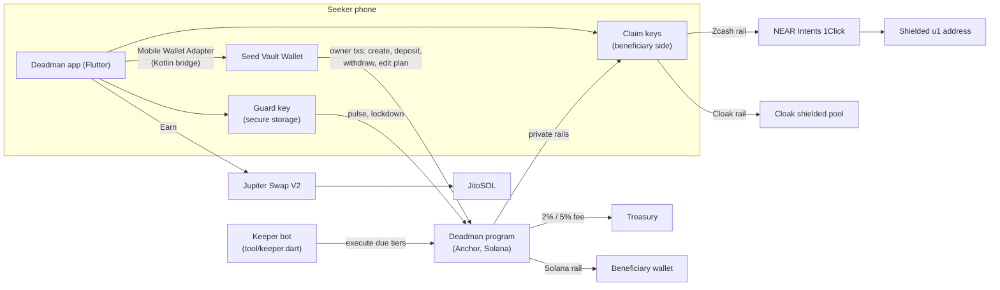
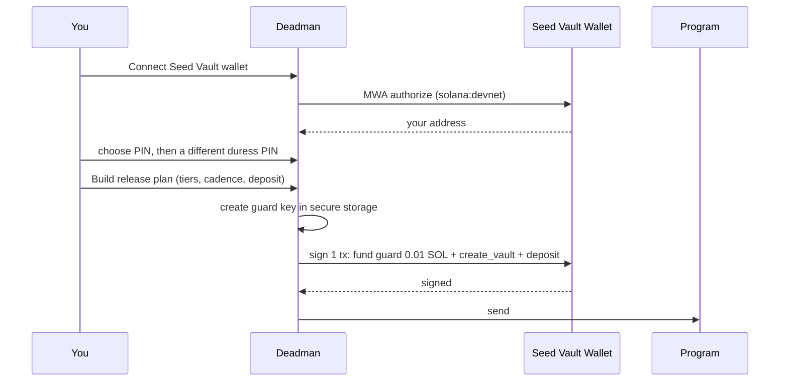
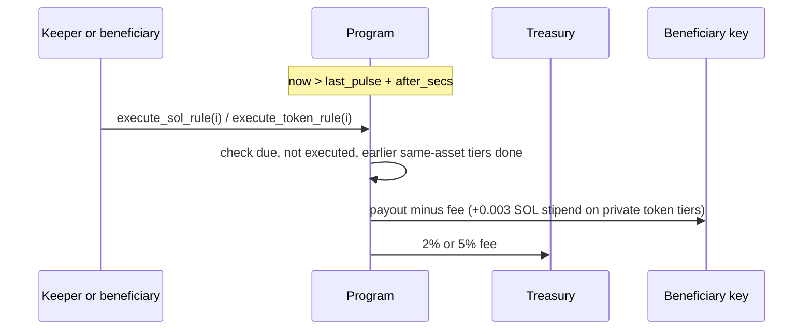

# How Deadman works

Every design choice, technology and user flow in the current build (program v2, 2026-10-02). Research behind the rails, with sources: [`docs/research/`](research/).

**In one paragraph:** Deadman is a vault on Solana that you control from your Seeker. You check in with a 3-second fingerprint "pulse". You write a _release plan_: tiers like "after 30 days of silence, send 10% of my SOL to my spouse; after 90 days, send everything else to my kids as shielded Zcash". If you stop checking in, the tiers fire in order. If someone forces you to open the app, a duress PIN silently freezes the vault. Deadman charges nothing to use; it takes a fee only when a tier actually releases funds, and earns on the optional staking yield path.

---

## 1. System map



The Solana program is the only component that holds funds. Everything else signs, schedules, or routes.

---

## 2. Technologies and why each was chosen

| Layer          | Technology                                                                      | Why this, not something else                                                                                                                                                                                                                                             |
| -------------- | ------------------------------------------------------------------------------- | ------------------------------------------------------------------------------------------------------------------------------------------------------------------------------------------------------------------------------------------------------------------------ |
| Chain          | **Solana**                                                                      | Seeker-native. A daily pulse costs ~0.000005 SOL, so frequent check-ins are free in practice.                                                                                                                                                                            |
| Program        | **Anchor 1.1.2** (Rust)                                                         | Declarative account checks (signer, PDA seeds, `has_one`) remove the most common Solana bugs. It also generates the IDL the app encodes against. Pinocchio wasn't needed: the most expensive instruction uses ~14.5k compute units.                                      |
| Program tests  | **LiteSVM**                                                                     | Runs the real compiled program in-process, with clock control to simulate "30 days of silence" in a millisecond. 17 tests.                                                                                                                                               |
| Lint gate      | **Solana `program_autofixer`**                                                  | Static security pass. It found no issues on v2.                                                                                                                                                                                                                          |
| App            | **Flutter 3.47** + Material 3                                                   | Your requirement. One codebase, ports later to any Android phone.                                                                                                                                                                                                        |
| State          | **Riverpod 3**                                                                  | Async providers fit "fetch vault, refresh, invalidate after a transaction" without boilerplate.                                                                                                                                                                          |
| Wallet         | **Mobile Wallet Adapter 2.2.0** through a **native Kotlin bridge**              | The only way to reach the Seed Vault is MWA → Seed Vault Wallet (keys never leave the secure element). The Dart MWA package (`solana_mobile_client`) has been unmaintained since May 2025, so we call the official Kotlin `clientlib-ktx` over a `MethodChannel`.        |
| Solana client  | **`solana` Dart 0.32** + a hand-written Borsh codec                             | RPC and keypairs come from the package. Instruction and account encoding is written against the IDL and tested byte by byte (36 tests).                                                                                                                                  |
| Device secrets | **flutter_secure_storage** (Android Keystore)                                   | Holds the guard key, claim keys and salted SHA-256 PIN hashes.                                                                                                                                                                                                           |
| Biometrics     | **local_auth**                                                                  | A fingerprint gates every pulse.                                                                                                                                                                                                                                         |
| Reminders      | **workmanager** + **flutter_local_notifications**                               | An hourly background check notifies you before a check-in is due. Android may delay it in Doze, which is acceptable: the on-chain timer is the source of truth, and each tier has a margin after the check-in deadline.                                                  |
| Zcash rail     | **NEAR Intents 1Click API**                                                     | The only verified way (Oct 2026) to swap Solana assets into **shielded** ZEC (`u1` unified addresses) with a plain REST API, which works from Dart.                                                                                                                      |
| Cloak rail     | **Cloak SDK 0.2.5** in a **headless WebView** (`flutter_inappwebview` 6.2 beta) | Every Cloak deposit needs a Groth16 zero-knowledge proof. The only prover is Cloak's TypeScript SDK (snarkjs + WebAssembly), and no Dart prover exists. We bundle it (3.4 MB) and run it in an invisible WebView on the phone, so the claim key never leaves the device. |
| Yield          | **Jupiter Swap V2** (`/order` + `/execute`) into **JitoSOL**                    | Jupiter's current API returns an unsigned v0 transaction that MWA can sign, and supports an integrator referral fee. A direct Jito stake-pool deposit is cheaper for the user but earns the protocol nothing.                                                            |
| Keeper         | **Dart CLI** (`tool/keeper.dart`)                                               | Reuses the app's own client code. It runs on any server or cron.                                                                                                                                                                                                         |

---

## 3. The on-chain design and the reasoning behind it

### 3.1 A vault PDA, not an "allowance"

Native SOL has no allowance mechanism. An SPL token delegate can be revoked by a thief as easily as by the owner. Only funds held by a program-owned account (PDA `["vault", owner]`) can be protected by time rules and lockdowns. The vault holds SOL directly and any SPL token in its associated token accounts.

### 3.2 Three keys, least privilege

| Key                     | Lives in                  | Can                                                       | Cannot                    |
| ----------------------- | ------------------------- | --------------------------------------------------------- | ------------------------- |
| **Owner**               | Seed Vault (hardware)     | deposit, withdraw, edit the plan, rotate the guard, close | —                         |
| **Guard**               | phone secure storage      | `pulse`, `lockdown`                                       | move funds, edit the plan |
| **Guardian** (optional) | a trusted person's wallet | `lockdown` (rate-limited), co-sign early `unlock`         | move funds                |

The guard key exists so daily check-ins and the duress PIN need **no wallet prompt**. If someone steals it, the worst they can do is check in for you or lock your vault. You rotate it with one owner signature, even during a lockdown.

### 3.3 The release plan (rules engine)

Each vault holds up to **8 rules**:

```
beneficiary · rail (Solana | Cloak | Zcash) · after_secs of silence
asset (SOL or a token mint) · Fixed amount or Percent of the balance at release time
```

- **When a rule is due:** after `last_pulse + after_secs`. A pulse resets every pending rule, so if you come back after a long trip, the remaining tiers stop. Tiers that already paid stay paid.
- **Order:** rules are sorted by delay. For the _same asset_, a rule can't run before the earlier ones. That makes "50% then 100% of the rest" mean the same thing no matter who executes first. Different assets don't block each other.
- **Who executes:** anyone. The destination is fixed in the rule, so the executor can't redirect anything. In practice it's the protocol keeper or a beneficiary.
- **Fixed amounts** are capped at the balance. **Dust:** a payout too small to open a new account (under ~0.00089 SOL) is marked executed with 0 paid instead of failing and blocking later tiers. The editor refuses fixed SOL tiers under 0.001 SOL.

### 3.4 Duress and lockdown

`lockdown` freezes withdrawals, plan edits and closing for `lock_secs` (1 minute to 30 days, depending on your cadence preset). It **does not** stop inheritance: if you are coerced and then disappear, the tiers still fire. The duress PIN signs `lockdown` with the guard key in the background, while the app keeps looking normal. Withdrawals fail with a fake "Seed Vault timed out", so the attacker never sees a lock screen. Plan edits are blocked during a lockdown, so a coercer can't redirect the payouts to themselves.

**Guardian rate limit:** when a guardian's lockdown expires, they can't lock again for another `lock_secs`. That guarantees you an unlocked window to remove a guardian who turned hostile.

### 3.5 Fees (your new pricing policy)

- **No subscription.** Creating a vault, depositing, checking in and locking are free (Solana network fees only).
- **Fee on release only**, charged on-chain from each payout: **2% on the Solana rail, 5% on private rails** (Cloak, Zcash). They are stored in the `Config` account; the admin can change them, but the program hard-caps both at **5%**.
- **Why the private rails cost more:** the beneficiary gets privacy and cross-chain delivery, and the payout also carries a 0.003 SOL gas stipend so their claim key can route the funds.
- **Why the fee lives in the program, not with the rail operators:** we measured NEAR Intents' `appFees` live. The fee you set is **split 50/50 with 1Click** and capped at 5% total, so a Deadman 5% through NEAR is impossible (2.5% maximum), and the fee would land inside NEAR, not in our Solana treasury. Charging on-chain is predictable and enforced the same way on every rail.
- If the treasury can't accept a tiny SOL fee (rent rules), the fee is waived to the beneficiary instead of blocking the payout.

### 3.6 Yield (Earn)

The program does no lending or staking calls (no CPI), so there is no extra smart-contract risk inside the vault. Instead:

1. The app swaps SOL → **JitoSOL** through Jupiter (you sign once in the Seed Vault Wallet).
2. It deposits the JitoSOL into the vault (second signature).
3. JitoSOL grows in value by itself (currently ~4.8% APY from Jito's stats API). Your tiers can pay out JitoSOL directly by choosing its mint as the asset.

**How Earn makes money:**

- **Jupiter referral fee** on the swap: minimum **0.5%**, and Jupiter keeps 20% of it. The fee is off unless `JUP_REFERRAL_ACCOUNT` is set at build time, because a wrong referral account makes the swap fail.
- **The normal 2–5% release fee**, which now applies to a balance that grew with the yield.

**Risks:** JitoSOL can trade below SOL in a crisis; swaps have slippage; and a 0.5% referral equals about 38 days of yield, so heavy fees make Earn worse than holding SOL for short periods.

---

## 4. The private rails, honestly

On-chain, every rail pays a **Solana key**. For private rails that key is a **claim key**: a fresh keypair created by the _beneficiary's_ Deadman app, never used for anything else. The beneficiary's app then routes the money:

|                             | Zcash rail                                                                                                                                                                          | Cloak rail                                                                                                                                                   |
| --------------------------- | ----------------------------------------------------------------------------------------------------------------------------------------------------------------------------------- | ------------------------------------------------------------------------------------------------------------------------------------------------------------ |
| Beneficiary sets up         | Security → Receive privately → a Zcash **unified `u1`** address (must be shielded-only)                                                                                             | Security → Receive privately → a Solana address to receive privately, or a Cloak shielded address                                                            |
| What they send the owner    | a claim code `zcash:<claim key>`                                                                                                                                                    | a claim code `cloak:<claim key>`                                                                                                                             |
| After the tier releases     | The app gets a 1Click quote (verifies 1Click's signature on it) and sends the SOL from the claim key to the quote's deposit address (the route also supports USDC/USDT, but the app's button forwards SOL only for now). ZEC arrives **shielded** in ~2–3 minutes. | The app starts the Cloak SDK in a hidden WebView, proves a deposit with zero knowledge on the phone (~6 s on desktop), and Cloak's relay delivers privately. |
| Fees on top of Deadman's 5% | about 0.2% (1Click) + 0.00032 ZEC network fee                                                                                                                                       | deposit free; private send to an address costs 0.3% + 0.005 SOL                                                                                              |
| Networks                    | mainnet only                                                                                                                                                                        | mainnet only (Cloak has no devnet program)                                                                                                                   |

**What stays visible** (judges will ask):

- **Public on Solana:** vault → claim key (amount, time).
- **Zcash:** NEAR's explorer maps the deposit address to the `u1` address. After that, ZEC inside the shielded pool is private. Use a fresh `u1` per inheritance.
- **Cloak:** the deposit amount into the pool is visible; what happens inside the pool is private.
- **So the rails break the link to the beneficiary's real wallet and future activity, not the fact that "this vault paid someone".** That's real privacy for heirs, but it isn't invisibility.
- **Not yet proven with real funds:** a full mainnet 1Click → `u1` swap, and a real Cloak deposit from a phone. The tests use captured live responses, but no money has moved through either rail.
- **Cloak shielded-address payouts:** the beneficiary still needs a scanning feature (about 1–2 days of work). Private sends to a Solana address work today.

---

## 5. App flows

### 5.1 First run



### 5.2 Daily pulse

Open the app → enter PIN → tap **I'm alive** → fingerprint → the guard key signs `pulse` (no wallet prompt) → the streak goes up and every pending tier's clock restarts. A reminder notification arrives when a check-in is due.

### 5.3 Duress

Forced to open the app → type the **duress PIN** → the app opens normally while the guard key silently sends `lockdown` → withdrawals spin and fail with "Seed Vault timed out" → the vault stays frozen for the lock period, and the attacker can't edit the plan.

### 5.4 Release (you went silent)



The beneficiary sees it in **Family Circle**. Solana-rail funds are already in their wallet. On a private rail they tap **Route privately** and the app forwards the funds as in §4.

### 5.5 Lost or replaced phone

On the new phone: connect the same Seed Vault wallet, then Security → **Move guard to this phone**. One signature, allowed even during a lockdown. The old guard key stops working.

### 5.6 Being someone's beneficiary

- **Solana rail:** give them your wallet address.
- **Private rails:** Security → Receive privately, paste your Zcash or Cloak destination, and send them the claim code.
- **Family Circle** shows each person who named you: alive, missed a check-in, or past a release tier; their streak; and your tiers with countdowns.

---

## 6. Business model (estimates, not data)

| Stream        | Mechanism                                             | Illustration                                                                            |
| ------------- | ----------------------------------------------------- | --------------------------------------------------------------------------------------- |
| Release fee   | 2% (Solana) / 5% (private) of each payout, on-chain   | $10M of protected assets, 1% released per year, about half via private rails: ~$3.5k/yr |
| Earn referral | ≥0.5% of each SOL→JitoSOL swap, protocol keeps 80%    | ~$4,000 per $1M swapped at 0.5%                                                         |
| Yield effect  | the release fee applies to a balance growing ~4.8%/yr | compounds the first stream                                                              |

An honest note, since you said you know the risks: releases are rare by nature (people rarely die or vanish in a given year), so the release fee alone stays small until protected assets reach the hundreds of millions. Earn swaps and the private rails' higher fee are what make the numbers move earlier. The SKR prize track (10k SKR) is no longer covered now that Plus is gone. An SKR integration that isn't a subscription would put it back in play; that's your call.

---

## 7. What you can demo where

| Feature                                         | Devnet (default build) | Mainnet build (`--dart-define=CLUSTER=mainnet-beta`) |
| ----------------------------------------------- | ---------------------- | ---------------------------------------------------- |
| Vault, pulse, streak, duress lockdown, guardian | yes                    | yes                                                  |
| Release plan with Solana-rail tiers, keeper     | yes                    | yes                                                  |
| Zcash rail routing                              | shows "mainnet only"   | yes (unproven with real funds)                       |
| Cloak rail routing                              | shows "mainnet only"   | yes (unproven with real funds)                       |
| Earn                                            | shows "mainnet only"   | yes                                                  |

## 8. Known limitations

- **Unaudited hackathon code.** Single-key admin (the upgrade authority).
- **Watched-vault lookup** scans every vault on the device; mainnet needs an indexer.
- **Private token payouts:** the app's "Route privately" forwards SOL only; USDC/USDT paid to a claim key stays there until that is wired.
- **Token-2022:** the program supports it (including transfer hooks), but the app's client is classic SPL only.
- **Leftover funds:** tokens or SOL arriving after the last tier has fired stay in the vault.
- **Stolen guard key:** it can delay inheritance by pulsing forever. Rotate it if your phone is lost.
- **NEAR Intents and Cloak** are third-party operators: they can see the claim key, amounts and IP, and NEAR has held funds for compliance before.
