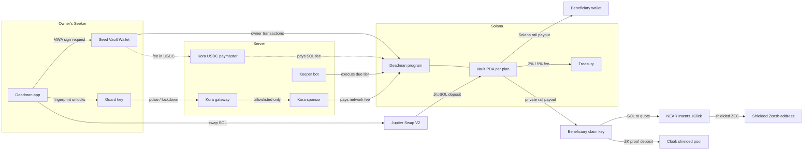

# Deadman pitch: technical slides (architect)

Four slides for judges. Status as of 2026-10-04. Every claim cites the code; external numbers cite repo docs. Visual tokens are from `lib/ui/theme.dart` (`bg #0A0B0D`, `surface #14161A`, `line #262A31`, `text #F2F3F5`, `muted #8A8F98`, `alive #3DF5A7`, `warn #FFB547`, `danger #FF4D5E`, `plus #9B7BFF`).

---

## Slide T1: System map

**Title:** One program holds the money. Everything else signs, schedules or routes.

### Boxes (label of 4 words or fewer, zone, color)

| ID  | Label                  | Zone                | Color / style            | Source                                                      |
| --- | ---------------------- | ------------------- | ------------------------ | ----------------------------------------------------------- |
| APP | Deadman app            | Owner's Seeker      | `surface`, `text`        | `lib/ui/app.dart`                                           |
| SVW | Seed Vault Wallet      | Owner's Seeker      | `raised`, `text`         | `lib/wallet/mwa_wallet_bridge.dart`                         |
| GK  | Guard key              | Owner's Seeker      | `raised`, `alive` border | `lib/state/secure_store.dart`                               |
| PRG | Deadman program        | Solana              | `alive` fill, `bg` text  | `onchain/programs/deadman/src/lib.rs`                       |
| VLT | Vault PDA per plan     | Solana (inside PRG) | `alive` border           | `instructions/vault.rs` seeds `["vault", owner, plan_id]`   |
| TRS | Treasury               | Solana              | `muted`                  | `state.rs` `Config.treasury`                                |
| KPR | Keeper bot             | Server              | `surface`                | `tool/keeper.dart`                                          |
| GW  | Kora gateway           | Server              | `surface`, `warn` border | `tool/kora_gateway.dart`                                    |
| SP  | Kora sponsor           | Server              | `surface`                | `kora/sponsor.toml`                                         |
| PM  | Kora USDC paymaster    | Server              | dashed, `muted`          | `lib/core/config.dart` `koraPaymasterUrl` (see open item 1) |
| BW  | Beneficiary wallet     | Beneficiary         | `surface`                | `funds.rs` `execute_sol_rule`                               |
| CK  | Beneficiary claim key  | Beneficiary's phone | `plus` border            | `lib/state/secure_store.dart`                               |
| NI  | NEAR Intents 1Click    | Private rails       | `plus`                   | `lib/rails/zcash_route.dart` (`1click.chaindefuser.com`)    |
| ZEC | Shielded Zcash address | Private rails       | `plus`                   | `lib/rails/zcash_route.dart`                                |
| CLK | Cloak shielded pool    | Private rails       | `plus`                   | `lib/rails/cloak_route.dart`, `cloak_webview_runtime.dart`  |
| JUP | Jupiter Swap V2        | Earn                | `muted`                  | `lib/rails/earn_jupiter.dart` (`api.jup.ag/swap/v2`)        |
| JTO | JitoSOL                | Earn                | `muted`                  | `lib/rails/earn_jupiter.dart`                               |

### Arrows (from → to: label)

| From | To  | Label               | Style                |
| ---- | --- | ------------------- | -------------------- |
| APP  | SVW | MWA sign request    | solid                |
| SVW  | PRG | owner transactions  | solid                |
| APP  | GK  | fingerprint unlocks | solid                |
| GK   | GW  | pulse / lockdown    | solid, `alive`       |
| GW   | SP  | allowlisted only    | solid                |
| SP   | PRG | pays network fee    | solid                |
| SVW  | PM  | fee in USDC         | dashed (in progress) |
| PM   | PRG | pays SOL fee        | dashed (in progress) |
| KPR  | PRG | execute due tier    | solid                |
| VLT  | BW  | Solana rail payout  | solid, `alive`       |
| VLT  | TRS | 2% / 5% fee         | solid, `muted`       |
| VLT  | CK  | private rail payout | solid, `plus`        |
| CK   | NI  | SOL to quote        | solid, `plus`        |
| NI   | ZEC | shielded ZEC        | solid, `plus`        |
| CK   | CLK | ZK proof deposit    | solid, `plus`        |
| APP  | JUP | swap SOL            | solid, `muted`       |
| JUP  | VLT | JitoSOL deposit     | solid, `muted`       |

**Footer line (one sentence):** No CPI to DeFi; the vault only calls the token program (`funds.rs` `vault_transfer`). Fees capped at 5% in code (`constants.rs` `MAX_FEE_BPS = 500`).

**Speaker note (15 s):** "The Seed Vault key does owner actions. A separate guard key on the phone can only check in or lock, and the fee sponsor pays for it, so a check-in is one fingerprint with no wallet prompt and no SOL. Each plan is its own PDA. Payouts are permissionless: a keeper or the heir triggers them, but the destination is fixed on-chain."

---

## Slide T2: How a release works (5 steps)

**Title:** Silence in, payout out. Nobody can redirect it.

1. **Silence.** No check-in, so `last_pulse + after_secs` passes. (`state.rs` `rule_due_at`)
2. **Anyone triggers.** The keeper or the heir calls `execute_sol_rule` / `execute_token_rule`. (`funds.rs`; keeper skips zero or unprofitable payouts: `tool/keeper.dart`)
3. **Program checks.** Due, not yet paid, earlier tiers of that asset settled, beneficiary and treasury match the stored ones. (`state.rs` `check_executable`; `funds.rs` `require_keys_eq!`, `address = config.treasury`)
4. **Pays.** Heir gets the net; treasury gets 2% (Solana rail) or 5% (private rails). Private token tiers also get SOL for gas (0.012 on Cloak, 0.003 on Zcash). (`state.rs` `split_fee`; `tool/init_config.dart` defaults 200/500 bps; `constants.rs` `CLOAK_GAS_STIPEND` / `ZCASH_GAS_STIPEND`)
5. **Stuck tier? Skip, not steal.** After the owner-chosen grace period anyone may `skip_rule`; its share stays reserved for that heir. Private-rail heirs then route to shielded ZEC or Cloak from their phone. (`funds.rs` `handle_skip_rule`, `state.rs` `reserved_for`; `lib/rails/`)

**Side panel, "Vesting, same program":** linear vesting with a cliff, revocable or irrevocable. Releases ignore check-ins; the owner can't withdraw what is still owed; revoking keeps what already vested. (`instructions/vault.rs` `handle_create_vesting`, `handle_revoke_vesting`; `state.rs` `vested`, `committed`; `funds.rs` `release_vested_sol/token`)

**Footnote:** A check-in resets every pending tier (`state.rs` `record_pulse`). Lockdown doesn't stop release (test `lockdown_does_not_stop_inheritance`).

---

## Slide T3: Security posture

**Title:** We tried to break it. Here's what we found and fixed.

**Left column: internal audit (2026-10-03)** (`docs/security-audit-2026-10-03.md`)

- 4 auditor lenses, each followed by an adversarial verifier that writes a PoC
- Found: **0 Critical · 2 High · 7 Medium · 11 Low · 14 Info**
- "No finding lets an unprivileged party steal user funds."
- **Fixed the same day:** both Highs, all 7 Mediums, L-1, L-2. A re-audit found 3 new Mediums in the fixes, and all 3 are fixed.
- Examples: a stuck tier no longer blocks the next one (skip and reserve); a stolen guard key can't keep a plan alive past 365 days (`constants.rs` `MAX_GUARD_ONLY_SECS`); claim keys come from a 12-word phrase.

**Right column: evidence**

| Check                   | Result                                                                                                                                                                                                              |
| ----------------------- | ------------------------------------------------------------------------------------------------------------------------------------------------------------------------------------------------------------------- |
| Program tests (LiteSVM) | **42 pass** (`cargo test`, 2026-10-04): a regression test for each fixed finding, plus 7 vesting/rent tests                                                                                                         |
| App tests (Flutter)     | **[N] app tests**: 239 test cases defined in `test/` on 2026-10-04, incl. 29 gateway and 16 keeper tests                                                                                                            |
| `program_autofixer`     | No issues (audit run); re-run 2026-10-04 on `instructions/vault.rs` account constraints: 0 issues                                                                                                                   |
| Compute units           | `execute_sol_rule` 17,718 · `pulse` 13,129 · `create_vault` (8 tiers) 17,498 (test `compute_unit_profile`)                                                                                                          |
| Kora gateway rules      | Only guard-signed `pulse`/`lockdown`; signature verified; guard read from the vault account; fee ≤ 50,000 lamports; CU ≤ 60,000; 24/vault, 48/guard, 2,000 total per 24 h; 60 req/min/IP (`tool/kora_gateway.dart`) |
| Checked arithmetic      | `checked_*`, u128 intermediates in fee/vesting math (`state.rs`)                                                                                                                                                    |

**Bottom strip:** **Not audited externally.** Before mainnet we still need Trident fuzzing, a verifiable build, a multisig upgrade authority with a timelock, and an external audit (audit doc, "Fix status").

---

## Slide T4: Trust model

**Title:** Least privilege, enforced on-chain.

| Role                          | Can                                                                                                                         | Cannot                                                                                                                              |
| ----------------------------- | --------------------------------------------------------------------------------------------------------------------------- | ----------------------------------------------------------------------------------------------------------------------------------- |
| **Owner** (Seed Vault)        | Create many plans, withdraw, edit tiers, rotate guard (even locked), check in, lock, revoke a revocable vesting plan, close | Withdraw, edit or close while locked; unlock early alone; take funds owed to vesting heirs; re-pay a paid tier; name itself as heir |
| **Guard** (phone key)         | Check in, lock down                                                                                                         | Move funds, edit the plan, unlock; keep a plan alive past 365 days or after a release without owner confirmation                    |
| **Guardian** (trusted person) | Lock down (with a cooldown); co-sign early unlock                                                                           | Check in, move funds, edit, unlock alone, lock again during the cooldown                                                            |
| **Beneficiary**               | Receive its tier; trigger it; send its token payout to another account it owns (by signing)                                 | Trigger early or out of order; take another tier's or a skipped tier's share; get paid twice                                        |
| **Anyone**                    | Deposit; trigger due tiers and vested releases; skip a stuck tier after the grace period                                    | Choose the destination or the amount; send a token payout to a non-standard account                                                 |
| **Admin**                     | Set treasury and fees, up to 5%                                                                                             | Touch any vault through instructions; set a fee above 5%. (Single-key upgrade authority today; multisig planned)                    |

**Citations:** owner: `vault.rs` `OwnerAction` (`has_one = owner`), `require_unlocked` in `withdraw_*`, `update_policy`, `close_vault`, `revoke_vesting`; `funds.rs` `FundsCommitted`; `state.rs` `apply_policy` (beneficiary ≠ owner/guard/vault; history kept). Guard: `vault.rs` `Pulse`/`Lockdown` constraints; `state.rs` `check_guard_pulse`. Guardian: `vault.rs` `handle_lockdown` (`guardian_ready_at`), `Unlock` (two signers). Beneficiary/anyone: `funds.rs` `ExecuteSolRule`/`ExecuteTokenRule` (`require_keys_eq!`, canonical ATA unless `beneficiary.is_signer`), `state.rs` `check_executable`, `payout_gross`, `reserved_for`. Admin: `config.rs` (`upgrade_authority_address == admin` at init, `MAX_FEE_BPS`, non-default treasury). Rent goes back to whoever paid it: `vault.rs` `CloseVault` (`has_one = rent_payer`, `close = rent_payer`); tests `sponsor_pays_vault_rent`, `close_returns_rent_to_the_sponsor_and_the_rest_to_the_owner`.

---

## Open items before the deck is locked

1. **USDC paymaster is not wired end to end.** The code has `AppConfig.koraPaymasterUrl`, `AppConfig.usdcMint`, `DeadmanApi.feeToken` (interface only) and a `payer` that can differ from the owner on `create_vault` (`vault.rs` `CreateVault.payer`). There is no paymaster node config in `kora/` (only `sponsor.toml`), and `tool/kora_gateway.dart` forwards only guard `pulse`/`lockdown` to the sponsor. `docs/KORA.md` still says "no token fee payment". Keep PM dashed, or label it "in progress", until it ships. Don't place it behind the gateway until the gateway routes to it.
2. **Vesting is on-chain only.** The program and the 7 tests are done. `lib/ui/screens/` has no vesting UI, `tool/keeper.dart` doesn't release vested amounts, and `DeadmanClient` doesn't implement the new API methods yet.
3. **The app test suite doesn't compile right now.** `flutter test` on 2026-10-04 fails on `lib/solana/deadman_client.dart:239`/`:274` (missing implementations of the new `DeadmanApi` members), so 6 test files fail to load. Re-run `flutter test` and put the passing count into "[N] app tests". The brief said ~250; 239 cases are defined today.
4. **Run `program_autofixer` again** on the full current `state.rs` + `funds.rs` (vesting code) before claiming "autofixer clean" for the whole program.
5. **Audit Lows L-3 to L-11** aren't in the audit's fix-status table, so treat them as open. Don't say "all findings fixed".
6. **Program upgrade:** these slides describe the working tree (uncommitted vesting/rent changes). Confirm that devnet `ACHVLMoLDM3YPpGbNST4cZW4Tf2jx6nzJGuusyLJHofL` runs this build before the demo.

## Placeholders

- `[N] app tests`: fill in from a green `flutter test` run.
